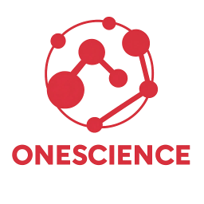

<div align="center">
  
</div>

# <div align="center"><strong>OneScience</strong></div>
### <div align="center">先进的科学智能(AI for Science)模型工具包</div>


OneScience是基于先进的深度学习框架打造的科学计算工具包，旨在通过一系列高度集成的组件加速科学研究和技术开发进程。该工具包包括前沿的数据集、基础模型、预训练模型以及前后处理工具，支持地球科学（气象、海洋）、生命信息（蛋白质、基因）、计算流体、工业仿真以及材料化学等多个领域的研究。

这些模型包括个可续研究的多数领域，包括：
*  地球科学
*  流体仿真
*  结构力学
*  生物信息
*  材料化学

除上述领域外，OneScience还包括了其它众多科研领域模型以及一些基础的科学数学组件。

项目中模型均在GPU和海光DCU平台上，完成测试验证。

## 最近更新
- 🔥 `2022年10月` 共性科学问题调研。
- 🔥 `2023年08月` OneScience基础项目启动，明确工程化 路线。
- 🔥 `2024年03月` OneScience平台逐渐成型，基于热点AI4S模型复现，工程化探索。
- 🔥 `2024年12月` v0.1.0版本，支持物理、化学、生物、计算科学等多学科的模型。科研流程接口。
- 🔥 `2025年10月` v0.2.0版本。开放生态 · 科学共智 。推动科研机构与AI企业共建科学智能平台，并行扩展能力支持，智能化改进。

## 使用手册
  如果你想快速了解OneScience的全部使用方法，可以参考我们的[使用手册](https://download2.sourcefind.cn:65024/9/main/onesicence)。

## 在线试用

你可以直接在[超算互联网平台](https://www.scnet.cn/ui/mall/app)试用大多数模型，同时，我们在平台上还提供了各个领域模型所需要的丰富的[数据集](https://www.scnet.cn/ui/mall/search/goods?common1=DATA&common2=DATA-330)。我们还为共有或者私有模型提供私有托管服务，欢迎交流合作。

以下是一些示例：

#### <div align="center">地球科学(AI for Earth Science)</div>

集合了不同的气象场景，例如全球中期天气预报、短临降雨等，并且提供前沿的数据集、基础模型、预训练模型.

问题类型| 案例 | 数据集 | 模型架构|
|:-:|:-:|:-:|:-:|
降尺度| [CorrDiff](examples/earth/corrdiff) | ERA5再分析数据集、HRRR | Unet、Diffusion |
中期天气预报 | [FourCastNet](examples/earth/fourcastnet) | ERA5再分析数据集 | AFNO |
中期天气预报 | [GraphCast](examples/earth/graphcast) | ERA5再分析数据集 | GNN |
中期天气预报 | [Pangu](examples/earth/pangu_weather) | ERA5再分析数据集 | 3DTransformer |
短临降雨 | [NowCastNet](examples/earth/nowcastnet) | MRMS | GAN |
中期天气预报 | [FengWu](examples/earth/fengwu) | ERA5再分析数据集 | 3DTransformer
中长期天气预报 | [Fuxi](examples/earth/fuxi) | ERA5再分析数据集 | 3DTransformer
短中期海洋预报 | [Oceancast](examples/earth/oceancast) | EMCMS海洋数据 | AFNO

数据集下载

ERA5是由欧洲中期天气预报中心开发和维护的一种全球范围内的高分辨率大气再分析数据集，工具包中提供通过气候数据存储(CDS)API下载ERA5数据集并将其处理为适合机器学习的工具[dataset_download](examples/earth/dataset_download)，使用者可以轻松灵活的为其训练数据集选择不同的气象变量。


#### <div align="center">计算流体(AI for CFD)</div>

问题类型| 案例 | 数据集 | 模型架构|
|:-:|:-:|:-:|:-:|
汽车设计| [Transolver-Car-Design](examples/cfd/Transolver-Car-Design) | Shape-Net Car | Transformer |
翼型设计 | [Transolver-Airfoil-Design](examples/cfd/Transolver-Airfoil-Design) | AirfRANS | Transformer |
圆柱绕流 | [MeshGraphNets](examples/cfd/vortex_shedding_mgn) | DeepMind旋涡脱落数据集 | GNN |
任意 2D 几何体绕流 | [DeepCFD](examples/cfd/DeepCFD) | DeepCFD数据集 | U-Net |
求解PDE的模型集 | [PDENNEval](examples/cfd/PDENNEval) | PDEBench | 多种模型集合 |
物理驱动求解PDE | [PINNsformer](examples/cfd/pinnsformer) | - | PINN |
不可压流体 | [CFDBench](examples/cfd/CFDBench) | CFDBench数据集 | 多种模型集合 |
复杂边界的椭圆偏微分方程 | [BENO](examples/cfd/beno) | 椭圆偏微分方程数据集 | Transformer，GNN |
圆柱绕流 | [lagrangian_mgn](examples/cfd/lagrangian_mgn) | DeepMind拉格朗日网格数据集 | GNN |
流体模型Benckmark |[CFD_Benchmark](examples/cfd/CFD_Benchmark) |多种数据集 | 多种模型集合
湍流 |[EagleMeshTransformer](examples/cfd/EagleMeshTransformer) |Eagle无人机数据集 | Transformer
拓扑优化 |[GP_for_TO](examples/cfd/GP_for_TO) |-| Gaussian Processes

#### <div align="center">结构力学(AI for Structural)</div>

问题类型| 案例 | 数据集 | 模型架构|
|:-:|:-:|:-:|:-:|
经典弹塑性力学问题| [DEM_for_plasticity](examples/structural/DEM_for_plasticity) | - | PINN |
2D平面应力问题 | [Plane_Stress](examples/structural/Plane_Stress) | - | PINN |

#### <div align="center">生物信息(AI for Biology)</div>
问题类型| 案例 | 数据集 | 模型架构|
|:-:|:-:|:-:|:-:|
蛋白质结构预测及设计| [AlphaFold3](examples/biosciences/alphafold3) | mmseqsDB,AF3官方数据集| Pairformer,Diffusion等多种模型集合|
蛋白质结构预测及设计| [Protenix](examples/biosciences/protenix) | Protenix官方数据集| Transformer,Diffusion等多种模型集合|
蛋白质设计（骨架设计）| [RFdiffusion](examples/biosciences/RFdiffusion) |-|diffusion|
蛋白质设计（骨架到序列设计）| [ProteinMPNN](examples/biosciences/ProteinMPNN) |-|MPNN|
蛋白质设计及优化| [PT-DiT](examples/biosciences/pt_dit) | - | Diffusion,Transformer|
突变预测,外显子分类,基因必要性| [Evo2](examples/biosciences/evo2) | OpenGenome2数据集| StripedHyena2|
药物设计| [MolSculptor](examples/biosciences/molsculptor) | - | Autoencoder，Latent Diffusion等多种模型集合|

#### <div align="center">材料化学(AI for MaterialsChemistry)</div>

问题类型| 案例 | 数据集 | 模型架构|
|:-:|:-:|:-:|:-:|
通用原子尺度模拟| [UMA](examples/MaterialsChemistry/UMA) | 多种第一性原理计算数据集的 大规模聚合(OC20，OMat24，OMol25，ODAC23,OMC25) | 等变图神经网络(GNN)
原子间势函数拟合 / 原子尺度模拟 | [MACE](examples/MaterialsChemistry/mace) | MPTrj, SPICE, OMat24 | E(3)-等变图神经网络 (E(3)-Equivariant GNN)

## 安装使用

### 安装OneScience
本项目 DCU 显卡所需的torch、torchvision、apex、dgl库下载地址： https://developer.hpccube.com/tool/
```shell
cd onescience
pip install -e . 
```
注：特殊依赖库需要与dtk版本对应。

### 快速开始
```python
>>> import torch
>>> from onescience.models.unet import UNet
>>> inputs = torch.randn(1, 1, 96, 96, 96).cuda()
>>> print("The shape of inputs: ", inputs.shape)
>>> model = UNet(
        in_channels=1,
        out_channels=1,
        model_depth=5,
        feature_map_channels=[64, 64, 128, 128, 256, 256, 512, 512, 1024, 1024],
        num_conv_blocks=2,
    ).cuda()
>>> x = model(inputs)
>>> print("model: ", model)
>>> print("The shape of output: ", x.shape)
```

## 支持与建议

如使用过程中遇到问题或想提出开发建议，可直接在超算互联网平台反馈，或者在Issue页面新建issue.

## License

This project **Onescience** is licensed under the [Apache License 2.0](LICENSE).

### Third-Party Components

This project also makes use of open-source software:

- [NVIDIA NeMo](https://github.com/NVIDIA/NeMo), licensed under the [Apache License 2.0](licenses/NeMo_LICENSE).

See the [NOTICE](NOTICE) file for details on third-party attributions.


## 🌐 Join the Community

We welcome you to join the OneScience WeChat community — a place for researchers, engineers, and enthusiasts to share insights and collaborate.

- 📱 **WeChat Group:** OneScience开放社区群  
- 💬 *Add our WeChat Group by scaning the QR code below.*

<div align="center">
  
</div>