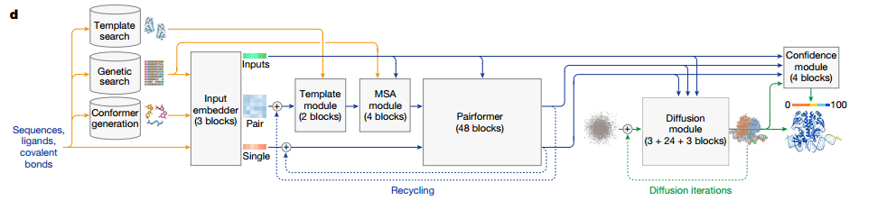
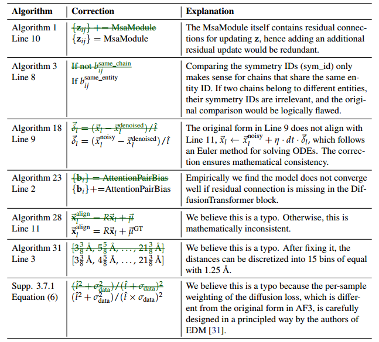
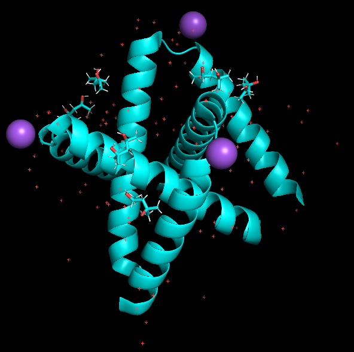
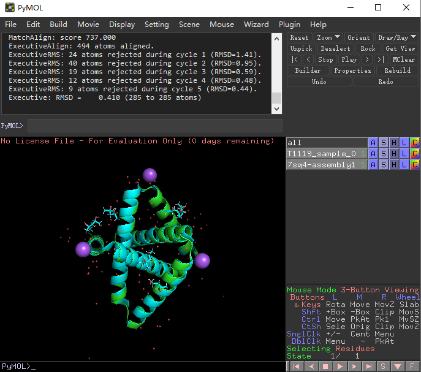

# 技术报告

https://github.com/bytedance/Protenix/blob/main/Protenix_Technical_Report.pdf

# 模型简介
该项目由字节跳动的 AML AI4Science 团队基于PyTorch的AlphaFold3开发，目标是改进复杂生物分子结构的预测实现可训练复现。该模型的推出打破了Alphafold3在应用中的局限性，Protenix作为一个完全开源项目，研究人员可以生成新预测并针对特定应用进行微调。该模型在不同分子类型的结构预测中表现出色，与 AlphaFold3、AlphaFold-Multimer 2.3 和 RoseTTAFold2NA 相比具有竞争力。

# 模型结构
主要参考AlphaFold3网络结构：



以下列出了Protenix在实现中与AlphaFold3的主要差异:
**解析器Parser**: 在选择替代位置时，研究人员使用第一个占据位置，而非最大占据位置。因为使用最大占据位置可能导致一些相邻残基采用不同构象，阻碍共价键的形成，导致链断裂。
**多序列比对 (MSA)**：研究人员使用MMSEQS2和ColabFold MSA管道进行MSA搜索，并从Uniref100数据库中提取用于配对的MSA（物种通过分类ID进行识别）。对于核酸链，不使用MSA。
**模板Templates**：研究人员不使用模板。
**特征化**:
   参考特征（Reference features）: 研究人员使用CCD的2024-06-08版本，并通过pdbeccdutils v0.8.5生成RDKit构象。当RDKit构象生成失败时，使用CCD理想坐标，避免使用代表性坐标以防止潜在的数据泄漏。
   键特征（Bond features）。键特征只包含配体内部的键、配体与聚合物之间的键，以及非标准残基内部的键。
**裁剪**：对裁剪方法的实现考虑了以下方面：
   在连续裁剪方法中，研究人员剔除了金属和离子，但在空间裁剪中保留它们。
   研究人员确保配体和非标准氨基酸保持完整，不被裁剪成不完整的片段。
   在空间裁剪中，将排列限制在裁剪区域内的链上，以确保预测集中在空间上接近的结构。
   在连续裁剪中，裁剪的链可能较远，但等价的链可能更接近彼此，因此允许等价的排列并根据模型预测调整裁剪区域。
下表中提供了引入修正的描述和解释，算法编号对应AF3补充材料中的算法编号：



# 数据集

预处理的 wwPDB 训练数据库，压缩包239G，解压后预计需要 1T的磁盘空间，可通过以下命令下载并解压预处理后的wwPDB训练数据库：

```shell
wget -P <数据存放目录> https://af3-dev.tos-cn-beijing.volces.com/release_data.tar.gz
tar -xzvf <数据存放目录>/release_data.tar.gz -C <数据存放目录>
```

解压后的数据库目录结构：

```shell
├── components.v20240608.cif [408M] # ccd源文件
├── components.v20240608.cif.rdkit_mol.pkl [121M] # 由 ccd 源文件生成的 RDKit Mol 对象
├── indices [33M] # chain 或者 interface 条目
├── mmcif [283G]  # raw mmcif data
├── mmcif_bioassembly [36G] # 预处理的wwPDB结构数据
├── mmcif_msa [450G] # msa文件
├── posebusters_bioassembly [42M] # 预处理的posebusters结构数据
├── posebusters_mmcif [361M] # raw mmcif data
├── recentPDB_bioassembly [1.5G] # 预处理的recentPDB结构数据
└── seq_to_pdb_index.json [45M] # 序列到PDB ID的映射文件
```

使用时可通过修改`examples/alphafold/protenix/configs/configs_data.py`文件中` DATA_ROOT_DIR` ，指定到数据集存放目录即可。

若只想下载推理数据，可通过以下指令下载，大约需要 529M 的磁盘空间，使用时同样需修改`DATA_ROOT_DIR`：

```shell
wget -P <数据存放目录> https://af3-dev.tos-cn-beijing.volces.com/release_data/components.v20240608.cif
wget -P <数据存放目录> https://af3-dev.tos-cn-beijing.volces.com/release_data/components.v20240608.cif.rdkit_mol.pkl
```

微调数据集示例列表可查看`examples/alphafold/protenix/ft_datasets/finetune_subset.txt`文件

# 训练

单卡训练：

```shell
sh train_demo.sh
```

`train_demo.sh`脚本主要参数设置说明，暂不支持`USE_DEEPSPEED_EVO_ATTTENTION`和`fast_layernorm`功能，默认不开启。

- run_name：模型名称，训练阶段名称为`protenix_train`

- seed：随机种子，确保训练过程可复现。默认42

- base_dir：输出保存路径，默认`output`

- dtype：训练精度，`bf16`和`fp32`可选

- project：项目名称，默认`protenix`

- use_wandb：是否使用`wandb`在线记录训练过程，`True`或`False`

- diffusion_batch_size：`diffusion`模块输入批次，默认48

- eval_interval：每`eval_interval`个step进行一次`eval`

- log_interval：每`log_interval`个step输出一次`loss`相关信息

- checkpoint_interval：每`checkpoint_interval`个step保存一次模型权重

- ema_decay：EMA 的衰减率，默认值为 0.999

- train_crop_size：训练裁剪大小，默认384

- max_steps：最大训练步数

- sample_diffusion.N_step：评估过程中，扩散过程的步数，默认设置 20，以提高效率

- data.train_sets：训练数据集，详细设置可参考文件`examples/alphafold/protenix/configs/configs_data.py`

- data.test_sets：评估数据集，多个数据集可用逗号分开

- data.posebusters_0925.base_info.max_n_token 768：限制`posebusters_0925`数据集只对`token<=768`的数据进行评估，加快评估过程

  

# 微调

单卡微调：

```shell
sh finetune_demo.sh
```

`finetune_demo.sh`暂不支持`USE_DEEPSPEED_EVO_ATTTENTION`和`fast_layernorm`功能，默认不开启。微调过程大多参数与训练脚本中设置一致，下面仅介绍不同于训练过程的参数设置：

- checkpoint_path：预训练权重文件路径

- run_name：模型名称，微调阶段名称为`protenix_finetune`
- load_checkpoint_path：预训练权重文件路径
- load_ema_checkpoint_path：设置同`load_checkpoint_path`
- data.weightedPDB_before2109_wopb_nometalc_0925.base_info.pdb_list：微调数据集列表

# 推理

单卡推理：

```shell
sh inference_demo.sh
```

`inference_demo.sh`脚本主要参数设置说明，暂不支持`USE_DEEPSPEED_EVO_ATTTENTION`和`fast_layernorm`功能，默认不开启。

- input_json_path：输入json文件路径
- dtype：推理精度，`bf16`和`fp32`可选
- num_workers：默认16，可根据测试环境cpu资源进行增减
- dump_dir：推理结果保存路径
- model.N_cycle：推理循环次数，默认10
- sample_diffusion.N_sample：推理生成样本个数，默认5

- sample_diffusion.N_step: 评估过程中，扩散过程的步骤数减少到`sample_diffusion.N_step`个以提高效率，默认200
- checkpoint_path: 设置进行微调的预训练模型路径

推理结果如下：

```shell
./7r6r
└── seed_101
    └── predictions
        ├── 7r6r_seed_101_sample_0.cif
        ├── 7r6r_seed_101_sample_1.cif
        ├── 7r6r_seed_101_sample_2.cif
        ├── 7r6r_seed_101_sample_3.cif
        ├── 7r6r_seed_101_sample_4.cif
        ├── 7r6r_seed_101_summary_confidence_sample_0.json
        ├── 7r6r_seed_101_summary_confidence_sample_1.json
        ├── 7r6r_seed_101_summary_confidence_sample_2.json
        ├── 7r6r_seed_101_summary_confidence_sample_3.json
        └── 7r6r_seed_101_summary_confidence_sample_4.json

2 directories, 10 files
```

# 推理结果可视化

• 可使用Pymol工具对输出结果进行可视化。工具下载链接：https://pymol.org 

• 具体使用：将推理输出cif文件加载到pymol工具。如下图所示。



工具命令行输入`align T1119_sample_0,7sq4-assembly1`回车，进行结构对比，如下图所示：




# 应用场景

蛋白质结构预测，药物研发，抗体设计等领域

# 预训练权重

权重下载方式：

```shell
wget -P /af3-dev/release_model/ https://af3-dev.tos-cn-beijing.volces.com/release_model/model_v0.2.0.pt
```


# 参考资料
https://github.com/bytedance/Protenix

# 许可证

Protenix 项目，包括代码和模型参数，依据 [Apache 2.0 许可协议](https://monica.im/home/chat/Monica/LICENSE) 提供，可免费用于学术研究和商业用途。

