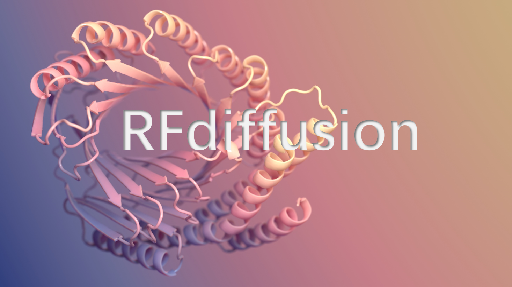
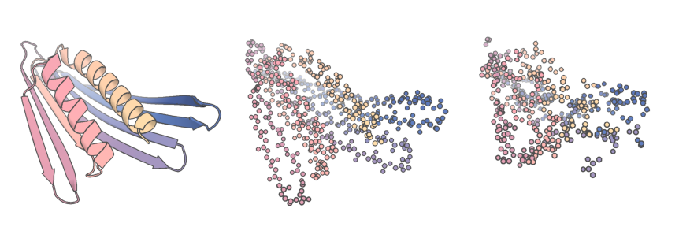
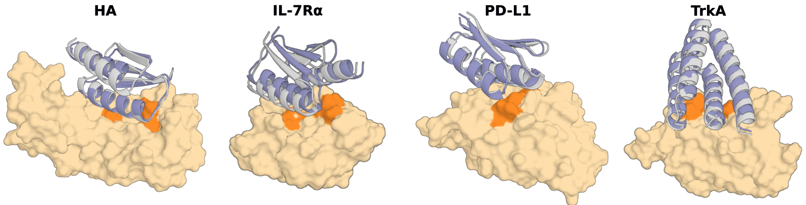
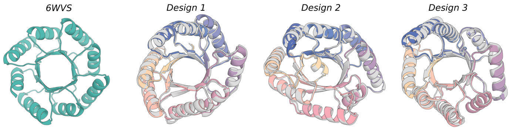
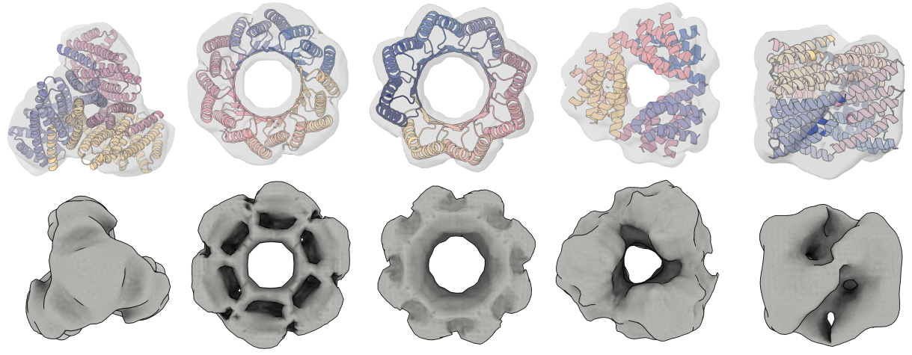
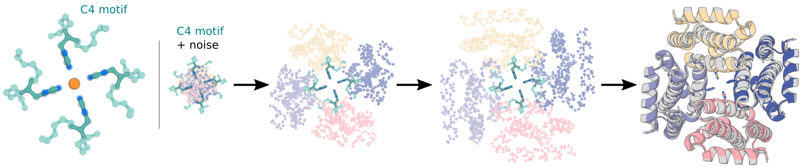

# RFdiffusion

本示例将 RFdiffusion 蛋白质结构生成模型集成到 OneScience，提供模型权重准备、无条件蛋白质生成、基序支架生成、部分扩散、结合蛋白设计、折叠条件设计、对称寡聚体生成以及辅助势函数引导等推理入口。

## 简介

RFdiffusion 是一个基于扩散模型的通用蛋白质设计框架，可从随机噪声出发生成蛋白质骨架，也可以在对称性、结合靶点、功能基序、二级结构等条件约束下进行结构设计。当前 OneScience 示例主要覆盖推理流程，不包含 RFdiffusion 的训练入口。

主要支持以下任务：

- 无条件蛋白质生成（Unconditional protein generation）
- 基序支架生成（Motif Scaffolding）
- 部分扩散（Partial Diffusion）
- 靶点结合蛋白设计（Binder design）
- 折叠条件设计（Fold Conditioning）
- 对称性无条件生成（Symmetric unconditional generation）
- 对称性基序支架生成（Symmetric motif scaffolding）
- 辅助势函数引导（Auxiliary Potentials）

- 论文：[De novo design of protein structure and function with RFdiffusion](https://www.nature.com/articles/s41586-023-06415-8)
- 官方仓库：[RosettaCommons/RFdiffusion](https://github.com/RosettaCommons/RFdiffusion)
- 许可证：[BSD License](https://github.com/RosettaCommons/RFdiffusion/blob/main/LICENSE)



## 目录

- [目录结构](#目录结构)
- [环境准备](#环境准备)
- [模型与素材准备](#模型与素材准备)
- [功能与入口](#功能与入口)
- [无条件蛋白质生成](#无条件蛋白质生成)
- [基序支架生成](#基序支架生成)
- [部分扩散](#部分扩散)
- [结合蛋白设计](#结合蛋白设计)
- [折叠条件设计](#折叠条件设计)
- [对称寡聚体生成](#对称寡聚体生成)
- [辅助势函数](#辅助势函数)
- [对称性基序支架生成](#对称性基序支架生成)
- [输出与复现](#输出与复现)
- [运行约束](#运行约束)
- [Issues](#issues)
- [许可证与引用](#许可证与引用)

## 目录结构

```text
examples/biosciences/RFdiffusion/
├── config/
│   └── inference/
│       ├── base.yaml                       # 基础推理配置
│       └── symmetry.yaml                   # 对称性生成配置
├── examples/
│   ├── design_unconditional.sh             # 无条件单体生成
│   ├── design_motifscaffolding.sh          # 基序支架生成
│   ├── design_motifscaffolding_inpaintseq.sh
│   ├── design_motifscaffolding_with_target.sh
│   ├── design_partialdiffusion.sh          # 部分扩散
│   ├── design_partialdiffusion_withseq.sh
│   ├── design_partialdiffusion_multipleseq.sh
│   ├── design_ppi.sh                       # PPI / Binder 设计
│   ├── design_ppi_scaffolded.sh            # 折叠条件 PPI 设计
│   ├── design_ppi_flexible_peptide.sh
│   ├── design_ppi_flexible_peptide_with_secondarystructure_specification.sh
│   ├── design_cyclic_oligos.sh             # 循环对称生成
│   ├── design_dihedral_oligos.sh           # 二面体对称生成
│   ├── design_tetrahedral_oligos.sh        # 四面体对称生成
│   ├── design_nickel.sh                    # 对称性基序支架示例
│   └── ...
├── helper_scripts/
│   ├── 2KL8.pdb
│   └── make_secstruc_adj.py                # 生成二级结构与块邻接输入
├── img/                                    # README 图片资源
├── scripts/
│   ├── download_models.sh                  # 下载主要 RFdiffusion 权重
│   └── run_inference.py                    # 核心推理入口
└── RFdiffusion_README.md
```

## 环境准备

请先在 OneScience 仓库根目录完成生物科学环境安装，并加载环境变量：

```bash
bash install.sh bio
source env.sh
```

随后进入 RFdiffusion 示例目录：

```bash
cd examples/biosciences/RFdiffusion
```

OneScience 的 `env.sh` 会设置数据和模型根目录。RFdiffusion 默认从以下位置读取模型：

```bash
${ONESCIENCE_MODELS_DIR}/RFdiffusion/models
```

该路径由 `config/inference/base.yaml` 中的 `inference.model_directory_path` 控制。如使用自定义模型位置，可修改该配置项或设置相应的环境变量。

## 模型与素材准备

### 模型权重

仓库提供 `scripts/download_models.sh` 用于下载主要 RFdiffusion 权重。建议直接下载到默认模型目录：

```bash
cd examples/biosciences/RFdiffusion
bash scripts/download_models.sh ${ONESCIENCE_MODELS_DIR}/RFdiffusion/models
```

该脚本会下载以下主要检查点：

- `Base_ckpt.pt`
- `Complex_base_ckpt.pt`
- `Complex_Fold_base_ckpt.pt`
- `InpaintSeq_ckpt.pt`
- `InpaintSeq_Fold_ckpt.pt`
- `ActiveSite_ckpt.pt`
- `Base_epoch8_ckpt.pt`

如希望完全沿用原 README 的手动下载方式，也可以执行：

```bash
cd RFdiffusion
mkdir models && cd models
wget http://files.ipd.uw.edu/pub/RFdiffusion/6f5902ac237024bdd0c176cb93063dc4/Base_ckpt.pt
wget http://files.ipd.uw.edu/pub/RFdiffusion/e29311f6f1bf1af907f9ef9f44b8328b/Complex_base_ckpt.pt
wget http://files.ipd.uw.edu/pub/RFdiffusion/60f09a193fb5e5ccdc4980417708dbab/Complex_Fold_base_ckpt.pt
wget http://files.ipd.uw.edu/pub/RFdiffusion/74f51cfb8b440f50d70878e05361d8f0/InpaintSeq_ckpt.pt
wget http://files.ipd.uw.edu/pub/RFdiffusion/76d00716416567174cdb7ca96e208296/InpaintSeq_Fold_ckpt.pt
wget http://files.ipd.uw.edu/pub/RFdiffusion/5532d2e1f3a4738decd58b19d633b3c3/ActiveSite_ckpt.pt
wget http://files.ipd.uw.edu/pub/RFdiffusion/12fc204edeae5b57713c5ad7dcb97d39/Base_epoch8_ckpt.pt
```

Optional：

```bash
wget http://files.ipd.uw.edu/pub/RFdiffusion/f572d396fae9206628714fb2ce00f72e/Complex_beta_ckpt.pt
```

原始结构预测权重：

```bash
wget http://files.ipd.uw.edu/pub/RFdiffusion/1befcb9b28e2f778f53d47f18b7597fa/RF_structure_prediction_weights.pt
```

### PPI 支架素材

运行支架条件的 PPI 设计时，需要准备示例支架文件。若仓库中提供 `examples/ppi_scaffolds_subset.tar.gz`，可执行：

```bash
tar -xvf examples/ppi_scaffolds_subset.tar.gz -C examples/
```

## 功能与入口

RFdiffusion 的核心推理由 `scripts/run_inference.py` 完成，并通过 Hydra 参数覆盖不同配置。不同任务主要通过 `contigmap`、`diffuser`、`ppi`、`scaffoldguided`、`potentials` 和 `inference` 等配置组进行控制。

| 任务 | 推荐入口 | 主要输入 | 主要输出 |
|------|----------|----------|----------|
| 模型权重下载 | `scripts/download_models.sh` | 下载目录 | RFdiffusion checkpoint |
| 无条件蛋白质生成 | `scripts/run_inference.py` / `examples/design_unconditional.sh` | 目标长度 | PDB、TRB、轨迹文件 |
| 基序支架生成 | `examples/design_motifscaffolding.sh` | 输入 PDB、contig | 设计骨架 |
| 序列隐藏基序支架 | `examples/design_motifscaffolding_inpaintseq.sh` | 输入 PDB、inpaint 区间 | 设计骨架 |
| 部分扩散 | `examples/design_partialdiffusion.sh` | 输入结构、`partial_T` | 原结构邻域中的多样化骨架 |
| Binder / PPI 设计 | `examples/design_ppi.sh` | 靶点 PDB、hotspot | 结合蛋白骨架 |
| 折叠条件设计 | `examples/design_ppi_scaffolded.sh` | 二级结构、邻接信息、靶点 | 条件约束骨架 |
| 二级结构/邻接生成 | `helper_scripts/make_secstruc_adj.py` | PDB | `.pt` 二级结构与邻接文件 |
| 对称寡聚体生成 | `examples/design_*_oligos.sh` | 对称类型、总长度 | 对称蛋白骨架 |
| 对称性基序支架 | `examples/design_nickel.sh` | 对称化基序 PDB | 对称基序支架 |

当前目录以 RFdiffusion 推理与设计为主，不提供模型训练脚本。


## 无条件蛋白质生成

最基础的无条件设计只需要指定蛋白长度、输出路径和生成数量。例如生成 10 个长度为 100–200 aa 的单体蛋白：

```bash
python ./scripts/run_inference.py 'contigmap.contigs=[100-200]' inference.output_prefix=test_outputs/test inference.num_designs=10
```

运行后会生成 10 条扩散轨迹，并将结果写入指定输出目录。

第一次运行 RFdiffusion 时，程序会计算 IGSO3 相关缓存，因此首次启动可能明显慢于后续运行。这属于正常行为。

完整示例可参考：

```text
./examples/design_unconditional.sh
```

## 基序支架生成


基序支架生成用于在保留指定结构基序的情况下，生成能够连接和支撑这些基序的新蛋白质骨架。RFdiffusion 使用 `contigmap.contigs` 描述固定基序、待生成区域和链断裂。

### Contig 语法

- 以链标识开头的区间表示输入 PDB 中需要保留的基序，例如 `A10-25`。
- 不带链标识的区间表示需要生成的蛋白质长度，例如 `30-40`。
- `/0` 表示链断裂。

例如，在链 A 的残基 10–25 两端分别生成 5–15 和 30–40 个残基：

```bash
'contigmap.contigs=[5-15/A10-25/30-40]'
```

固定生成总长度为 55 个残基：

```bash
contigmap.length=55-55
```

指定输入 PDB：

```bash
inference.input_pdb=path/to/file.pdb
```

如需在独立链 B 存在的情况下进行支架生成，可使用：

```bash
'contigmap.contigs=[5-15/A10-25/30-40/0 B1-100]'
```

### 活性位点模型

对于很小的功能基序，可使用专门针对微小基序固定进行微调的 ActiveSite 模型：

```bash
inference.ckpt_override_path=models/ActiveSite_ckpt.pt
```

### 隐藏部分序列

当连接蛋白时，如果希望某些原本暴露的残基重新设计为更适合蛋白核心的序列，可通过 `contigmap.inpaint_seq` 隐藏相应序列：

```bash
'contigmap.inpaint_seq=[A1/A30 - 40]'
```

完整示例：

```text
./examples/design_motifscaffolding.sh
./examples/design_motifscaffolding_inpaintseq.sh
```

### 扩散时间步

RFdiffusion 最初使用 200 个离散时间步训练。当前推理配置默认 `diffuser.T=50`，许多场景可使用更少时间步以加速生成。`diffuser.T` 与部分扩散中的 `diffuser.partial_T` 直接相关，调整时应同时考虑两者的比例。

## 部分扩散



部分扩散（Partial Diffusion）会从已有结构出发进行部分加噪与去噪，用于在已有折叠附近生成结构多样性。

通过 `diffuser.partial_T` 控制加噪程度：

- `partial_T` 越大，生成结构通常越多样。
- `partial_T` 越小，输出越接近输入结构。

对于当前默认的 `diffuser.T=50`，原始 200 步设置下常用的 `partial_T=80` 大致对应当前的 `partial_T=20`。

例如，对长度为 100 的结合体和长度为 150 的目标蛋白执行部分扩散时，原 README 给出的 Hydra 参数为：

```bash
'contigmap.contigs=[100-100/0 B1-150]' diffuser.partial_T=20
```

部分扩散要求 contig 指定的长度与输入结构实际长度一致。不能通过部分扩散直接为输入结构不存在的位置新增残基。

### 固定部分序列

部分扩散过程中可以固定指定序列。原 README 示例参数为：

```bash
'contigmap.contigs=[100 - 100/0 20 - 20]' 'contigmap.provide_seq=[100 - 119]' diffuser.partial_T = 10
```

多个序列区间可使用逗号分隔：

```bash
'contigmap.provide_seq=[172 - 177, 200 - 205]'
```

完整示例：

```text
./examples/design_partialdiffusion.sh
./examples/design_partialdiffusion_withseq.sh
./examples/design_partialdiffusion_multipleseq.sh
```

## 结合蛋白设计



RFdiffusion 可直接围绕目标蛋白生成结合蛋白骨架。例如，目标蛋白为链 B，并生成长度为 100 aa 的结合体：

```bash
./scripts/run_inference.py 'contigmap.contigs=[B1 - 100/0 100 - 100]' inference.output_prefix=test_outputs/binder_test inference.num_designs=10
```

### Hotspot 残基

对于大型目标蛋白，建议裁剪到与结合区域相关的部分，并通过 hotspot 指定希望结合体接触的目标残基：

```bash
'ppi.hotspot_res=[A30,A33,A34]'
```

通常可先选择 3–6 个 hotspot 残基进行小规模测试，再扩大设计数量。

### Beta 结合蛋白模型

默认模型更偏向生成螺旋型结合体。如希望探索更多拓扑结构，可尝试 Beta 模型：

```bash
inference.ckpt_override_path=models/Complex_beta_ckpt.pt
```

该模型提供更高拓扑多样性，但实验验证相对较少。

### 实际设计建议

- 目标区域通常需要存在可形成稳定疏水作用的表面。
- 大型目标蛋白建议裁剪，但应避免暴露原本埋藏在核心的疏水残基。
- RFdiffusion 运行成本随系统残基数近似按 `O(N^2)` 增长。
- RFdiffusion 主要生成蛋白质骨架，设计残基通常以 Glycine 形式写出；后续序列设计可结合 ProteinMPNN-FastRelax 等流程。
- 原始论文使用 AlphaFold2 等结构预测方法对候选设计进行筛选。

完整示例：

```text
./examples/design_ppi.sh
```

## 折叠条件设计



折叠条件设计通过二级结构和块邻接（block adjacency）信息，对单体或结合蛋白的拓扑结构进行约束。

### 生成二级结构与邻接信息

处理单个 PDB：

```bash
cd helper_scripts
./make_secstruc_adj.py --input_pdb ./2KL8.pdb --out_dir /my/dir/for/adj_secstruct
```

处理一个 PDB 目录：

```bash
./make_secstruc_adj.py --pdb_dir ./pdbs/ --out_dir /my/dir/for/adj_secstruct
cd ..
```

### 支架条件推理

```bash
./scripts/run_inference.py inference.output_prefix=./scaffold_conditioned_test/test scaffoldguided.scaffoldguided=True scaffoldguided.target_pdb=False scaffoldguided.scaffold_dir=./examples/ppi_scaffolds_subset
```

对于 PPI 设计，还可以提供目标蛋白、目标二级结构和邻接信息。原 README 给出的参数组合为：

```bash
scaffoldguided.target_pdb=True scaffoldguided.target_path=input_pdbs/insulin_target.pdb inference.output_prefix=insulin_binder/jordi_ss_insulin_noise0_job0 'ppi.hotspot_res=[A59, A83, A91]' scaffoldguided.target_ss=target_folds/insulin_target_ss.pt scaffoldguided.target_adj=target_folds/insulin_target_adj.pt
```

### Loop mask 与长度采样

RFdiffusion 在训练时会掩盖部分二级结构和邻接信息，因此推理时可以通过 loop mask 增加拓扑自由度：

```bash
scaffoldguided.mask_loops=True scaffoldguided.sampled_insertion=15 scaffoldguided.sampled_N=5 scaffoldguided.sampled_C=5
```

如果只希望从大量支架文件中选择部分输入，可设置：

```bash
scaffoldguided.scaffold_list=path/to/list
```

### 降低推理噪声

对于 PPI 设计，可尝试降低平移和旋转噪声：

```bash
denoiser.noise_scale_ca=0.5 denoiser.noise_scale_frame=0.5
```

通常可提高设计质量，但会降低生成多样性。

### 灵活肽设计

对于柔性肽，可先隐藏其三维结构：

```bash
inference.input_pdb=input_pdbs/tau_peptide.pdb 'contigmap.contigs=[70-100/0 B165-178]' 'contigmap.inpaint_str=[B165-178]'
```

随后可进一步指定二级结构，例如 β 片层：

```bash
scaffoldguided.scaffoldguided=True 'contigmap.inpaint_str_strand=[B165-178]'
```

或 α 螺旋：

```bash
scaffoldguided.scaffoldguided=True 'contigmap.inpaint_str_helix=[B165-178]'
```

相关示例可参考 `examples/design_ppi_scaffolded.sh` 与柔性肽相关脚本。

## 对称寡聚体生成



RFdiffusion 可在初始噪声和每一个扩散时间步中施加对称化约束。当前示例支持：

- 循环对称（Cyclic symmetry）
- 二面体对称（Dihedral symmetry）
- 四面体对称（Tetrahedral symmetry）

例如生成四面体对称寡聚体：

```bash
./scripts/run_inference.py --config-name symmetry  inference.symmetry=tetrahedral 'contigmap.contigs=[360-360]' inference.output_prefix=test_sample/tetrahedral inference.num_designs=1
```

`contigmap.contigs` 指定的是寡聚体总长度，必须与对应对称体系的链数兼容。

完整示例：

```text
./examples/design_cyclic_oligos.sh
./examples/design_dihedral_oligos.sh
./examples/design_tetrahedral_oligos.sh
```

## 辅助势函数

RFdiffusion 支持通过 Auxiliary Potentials 在反向扩散过程中对生成轨迹施加可微约束。例如，可通过回转半径势推动单体结构更加紧凑，或通过接触势控制寡聚体链内与链间接触。

势函数通过 `potentials.guiding_potentials` 设置：

```bash
potentials.guiding_potentials=["type:monomer_ROG,weight:1", "type:olig_contacts,weight_intra:1,weight_inter:0.1"]
```

主要参数包括：

- `type`：势函数类型，必填。
- `weight` / `weight_intra` / `weight_inter`：不同势函数的权重。
- `potentials.guide_scale`：整体引导强度。
- `potentials.guide_decay`：随扩散时间步变化的衰减方式。

`potentials.guide_decay` 支持：

- `constant`
- `linear`
- `quadratic`
- `cubic`

示例：

```bash
potentials.guiding_potentials=["type:olig_contacts,weight_intra:1,weight_inter:0.1"] potentials.olig_intra_all=True potentials.olig_inter_all=True potentials.guide_scale=2 potentials.guide_decay='quadratic'
```

建议先以不使用势函数的结果作为基线，再逐步增加引导强度。权重过大可能降低生成质量，权重过小则可能几乎没有作用。自定义势函数必须保持可微。

## 对称性基序支架生成



RFdiffusion 可以组合对称扩散和基序支架生成，对称地生成包含功能基序的蛋白结构。

对称性基序支架要求输入 PDB 已经按照目标对称关系进行对称化，否则基序中心对齐和固定对称轴传播可能产生错误结果。

当前标准对称轴定义：

| Group | Axis |
|------|------|
| Cyclic | Z |
| Dihedral（循环轴） | Z |
| Dihedral（翻转/反射轴） | X |

`examples/design_nickel.sh` 展示了 C4 对称镍结合域的设计过程，同时结合了对称生成、基序支架和辅助势函数。

## 输出与复现

### 输出文件

RFdiffusion 推理主要产生以下输出：

1. **`.pdb` 文件**
   - 最终预测的蛋白质骨架结构。
   - 新设计残基通常以 Glycine 形式输出。
   - 输出主要表示骨架结构，不应把设计区域侧链视为可靠序列预测。

2. **`.trb` 文件**
   - 保存当前运行的元数据和完整配置。
   - 包含输入与输出残基之间的映射关系，例如 `con_ref_pdb_idx`、`con_hal_pdb_idx`、`con_ref_idx0`、`con_hal_idx0`。
   - 记录推理时使用的 inpaint 序列信息等。

3. **轨迹文件**
   - 默认写入输出目录下的 `traj/`。
   - 包含多步 PDB，可在 PyMOL 中查看扩散轨迹。
   - 包含各时间步的 `pX0` 预测和 `Xt-1` 轨迹。

## 运行约束

- RFdiffusion 当前 OneScience 示例主要面向推理，不包含模型训练流程。
- 不同任务可能需要不同 checkpoint；推理脚本会根据输入配置选择相应模型，手动覆盖 checkpoint 时必须确保模型理解对应输入特征。
- `model`、`preprocess` 和大部分 `diffuser` 结构配置与训练过程耦合，不建议在不理解模型训练设定的情况下直接修改。
- 部分扩散要求输入结构长度与 contig 长度一致。
- 大型 PPI 目标会显著增加计算与显存开销，运行时间随系统残基数近似按 `O(N^2)` 增长。
- 降低 `denoiser.noise_scale_ca` 和 `denoiser.noise_scale_frame` 通常会提高确定性与结构质量，但降低多样性。
- `inference.final_step` 可用于提前停止扩散过程，以减少推理时间；修改后应验证结果质量。
- RFdiffusion 输出属于计算设计结果，后续序列设计、结构预测筛选和实验验证仍是完整蛋白设计流程的重要组成部分。

## Issues

- **模型目录找不到**：确认已执行 `source env.sh`，并检查 `${ONESCIENCE_MODELS_DIR}/RFdiffusion/models` 是否存在及权重是否完整。
- **首次推理很慢**：首次运行会计算并缓存 IGSO3 数据，后续运行通常会明显加快。
- **输入某类条件后程序崩溃**：检查当前 checkpoint 是否支持该输入特征。例如二级结构约束需要使用支持 fold conditioning 的模型。
- **Partial Diffusion 运行异常**：确认 `contigmap.contigs` 描述的长度与输入 PDB 实际结构长度一致。
- **PPI 显存或运行时间过高**：可优先裁剪与结合区域无关的目标结构，但应避免暴露原本埋藏的疏水核心。
- **设计质量或多样性不足**：可逐步调整 `diffuser.partial_T`、噪声强度、hotspot、势函数权重等参数，并保留无额外约束的基线结果用于比较。

## 许可证与引用

RFdiffusion 代码以 BSD 开源许可发布，可用于非营利和营利用途。使用本示例进行研究或开发时，应同时遵循 OneScience、RFdiffusion 模型权重及相关依赖的许可证要求。

建议引用：

> Watson, Joseph L., et al. "De novo design of protein structure and function with RFdiffusion." *Nature* 620.7976 (2023): 1089–1100.

相关资源：

- [RFdiffusion 官方仓库](https://github.com/RosettaCommons/RFdiffusion)
- [RFdiffusion 官方 README](https://github.com/RosettaCommons/RFdiffusion/blob/main/README.md)
- [RFdiffusion Nature 论文](https://www.nature.com/articles/s41586-023-06415-8)
