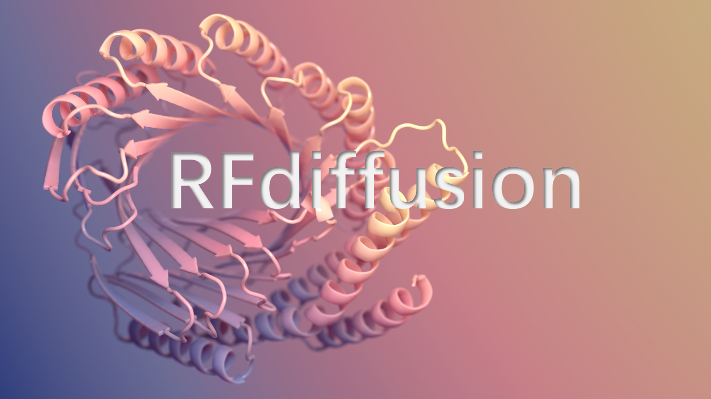
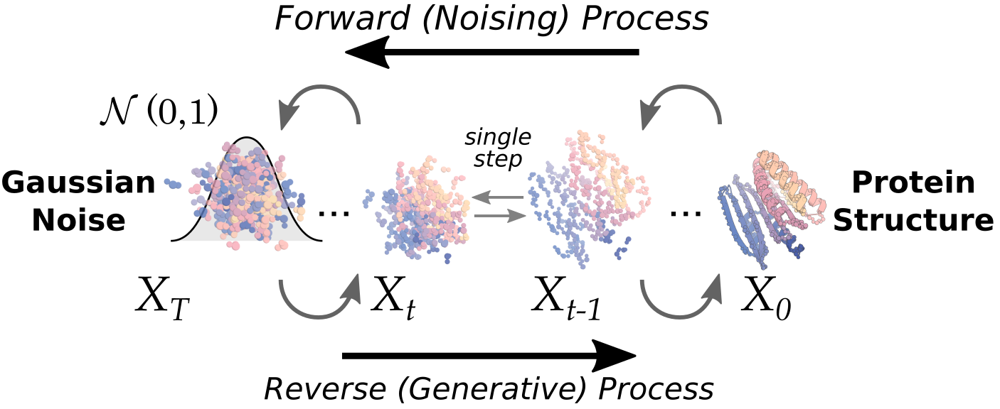
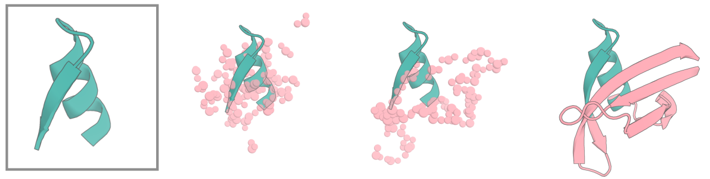
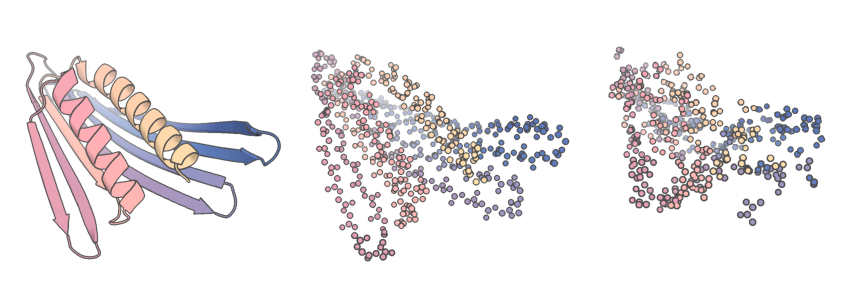
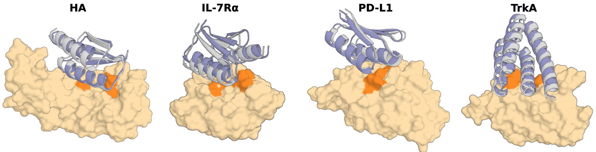
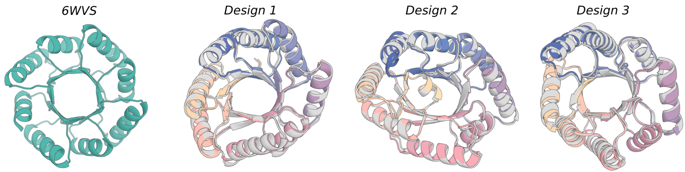
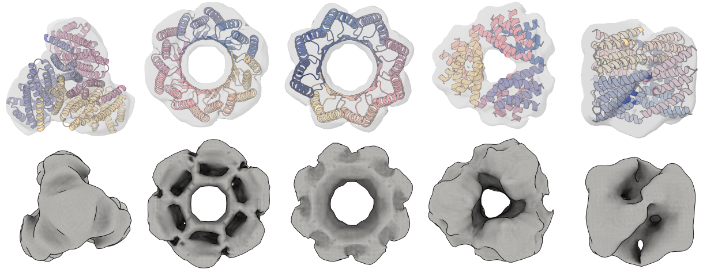
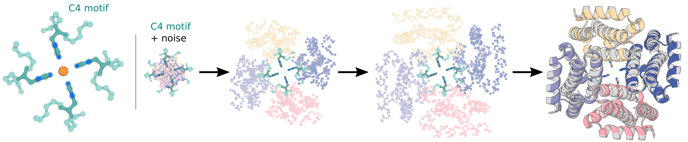

# RFdifusion
## 1. 模型简介
 <div align=left>  </div><br>

**RFdiffusion** 提出了一个基于扩散模型的通用的蛋白质设计框架，在蛋白质设计的多个方面表现出色，能够生成多样化、高精度的蛋白质结构，解决多种复杂的设计挑战，为蛋白质设计领域提供了强大的工具。
**RFdiffusion**的设计既可以是无条件的，也可以在随机噪声之外对对称性、结合靶点、功能基团等加以限制，从而适用于不同场景的蛋白设计。

**RFdiffusion可以胜任以下任务：** 

- 无条件蛋白质生成（Unconditional protein generation）
- 基序支架生成（Motif Scaffolding）
- 对称性无条件生成（Symmetric unconditional generation）：目前已实现循环对称、二面体对称和四面体对称，未来会支持更多类型！
- 对称性基序支架生成（Symmetric motif scaffolding）
- 靶点结合蛋白设计（Binder design）
- 设计多样化（Design diversification）：通过“部分扩散”（partial diffusion）实现，即围绕已有设计进行采样。


<p>更详细的模型信息可参考<a href="https://www.nature.com/articles/s41586-023-06415-8" target="_blank">RFdiffusion论文</a> </p>

## 2. 素材准备
### 2.1 权重文件准备
权重已通过以下指令下载至`./models`目录。

**建议**下载完成后在`config/inference/base.yaml`文件的第23行，指定models目录的绝对路径（key为`inference.model_directory_path`）。
```shell
cd RFdiffusion
mkdir models && cd models
wget http://files.ipd.uw.edu/pub/RFdiffusion/6f5902ac237024bdd0c176cb93063dc4/Base_ckpt.pt
wget http://files.ipd.uw.edu/pub/RFdiffusion/e29311f6f1bf1af907f9ef9f44b8328b/Complex_base_ckpt.pt
wget http://files.ipd.uw.edu/pub/RFdiffusion/60f09a193fb5e5ccdc4980417708dbab/Complex_Fold_base_ckpt.pt
wget http://files.ipd.uw.edu/pub/RFdiffusion/74f51cfb8b440f50d70878e05361d8f0/InpaintSeq_ckpt.pt
wget http://files.ipd.uw.edu/pub/RFdiffusion/76d00716416567174cdb7ca96e208296/InpaintSeq_Fold_ckpt.pt
wget http://files.ipd.uw.edu/pub/RFdiffusion/5532d2e1f3a4738decd58b19d633b3c3/ActiveSite_ckpt.pt
wget http://files.ipd.uw.edu/pub/RFdiffusion/12fc204edeae5b57713c5ad7dcb97d39/Base_epoch8_ckpt.pt

Optional:
wget http://files.ipd.uw.edu/pub/RFdiffusion/f572d396fae9206628714fb2ce00f72e/Complex_beta_ckpt.pt

# original structure prediction weights
wget http://files.ipd.uw.edu/pub/RFdiffusion/1befcb9b28e2f778f53d47f18b7597fa/RF_structure_prediction_weights.pt
```


### 2.2 获取 PPI 支架示例
要运行支架蛋白结合体设计（PPI）的示例，我们提供了一些示例支架文件（```examples/ppi_scaffolds_subset.tar.gz```）。您需要解压这些文件：

```shell
tar -xvf examples/ppi_scaffolds_subset.tar.gz -C examples/
```

有关这些文件的用途以及如何使用它们的说明，请参阅“折叠条件设计”部分。

## 3. 推理
<p align="center">
  
</p>

运行`./scripts/run_inference.py`脚本进行推理。其运行方式受到**Hydra 配置**的控制。Hydra是一种灵活的配置方式，可以指定许多不同的选项，并且默认值直接从模型检查点（checkpoint）中提取。因此，推理过程默认情况下会与训练保持一致。

这意味着，config/inference/base.yml 中的默认值可能并不完全匹配特定检查点在推理过程中实际使用的值。不过这些差异都会在底层自动处理，无需用户操心。

### 3.1 无条件单体蛋白设计
首先，进行一次最基础的无条件单体蛋白设计，需要指定以下三个参数：
- 蛋白长度在100-200个残差之间（每次设计取区间内的随机值）
- 输出路径为test_output/test 
- 生成10次

```shell
./scripts/run_inference.py 'contigmap.contigs=[100-200]' inference.output_prefix=test_outputs/test inference.num_designs=10
```

运行此命令后，RFdiffusion 会生成 10 条扩散轨迹（diffusion trajectories），并将结果保存到您指定的输出文件夹中。

注意：第一次运行 RFdiffusion 时，脚本会花时间计算 IGSO3。计算结果会被缓存，供将来参考。如果需要更多无条件单体生成的示例，请查看仓库中的``` ./examples/design_unconditional.sh```。


### 3.2 基序支架 （Motif Scaffolding）
<div align=left>  </div><br>

在蛋白质设计中，基序支架（Motif Scaffolding）是一种设计策略，通常用于通过重新排列和组合已知的蛋白质结构基序（motif），来构建新的、功能性强的蛋白质。这里的“基序”指的是蛋白质中某些具有特定功能或结构特征的序列片段，它们可能在多个蛋白质中反复出现。
**基序 (Motif)**： 蛋白质基序是指某些特定的氨基酸序列或结构单元，它们能够形成特定的空间结构，并执行特定的生物学功能。例如，许多酶的催化活性依赖于它们的活性位点，活性位点通常由几个保守的基序组成。

**支架 (Scaffolding)**： 支架是一种框架结构，它通常用于支撑其他功能性基序或结构。通过将不同的基序组装到一个稳定的支架中，设计者可以创造出具有新功能的蛋白质。

当对蛋白质基序（motif）进行支架生成（scaffolding）时，需要首先指定基序（来自.pdb文件的一个或多个片段），并定义支架如何连接，以及在新生成蛋白质中的连接长度。此外，我们希望能够对连接蛋白质的不同长度进行采样，因为我们通常事先不知道精确需要多少个残基来最佳地搭建一个基序。这个指定输入的工作由 contigs 处理，由 hydra 配置中的 contigmap 配置控制。

**contigs 语法简介**：
- 以字母为前缀：表示这是一个基序，其中字母对应输入 PDB 文件中的链标识。例如，```A10-25``` 表示输入 PDB 文件中链 A 的残基 10 到残基 25（包括 10 和 25）。
- 不以字母为前缀：表示要生成的蛋白质。这可以输入为长度范围，RFdiffusion 在每次推理迭代中会随机采样该范围的长度。
- 链断裂通过 ```/0``` 指定。

**详细示例：** 
如果希望支架生成链 A 上的残基 10-25，并在其 N 端生成 5-15 个残基，在其 C 端生成 30-40 个残基，可以使用以下语法：
```'contigmap.contigs=[5-15/A10-25/30-40]'```
- ```5-15```：在链 A 的 N 端随机生成 5 到 15 个残基。
- ```A10-25```：表示输入 PDB 文件中链 A 的残基 10 到 25。
- ```30-40```：在链 A 的 C 端随机生成 30 到 40 个残基。

如果希望生成的蛋白质长度固定为 55 个残基，可以通过以下命令指定：
```contigmap.length=55-55```
此外，您还需要指定 PDB 文件路径：
```inference.input_pdb=path/to/file.pdb```
即使输入 PDB 文件中有其他链（如链 B）或链 A 上的其他残基，RFdiffusion 只会使用 Contig Map 中定义的部分（如 ```A10-25```）作为基序部分参与支架生成。

**指定链断裂的支架生成**
如果希望在存在独立链 B 的情况下对链 A 的残基进行支架生成，可以使用以下语法：
```'contigmap.contigs=[5-15/A10-25/30-40/0 B1-100]'```
- ```/0``` 指定了链的断裂。
- 空格非常重要，它告诉模型需要添加一个大跳跃（200aa），以便模型将第一条链视为与第二条链在不同的链上。

**示例脚本**
您可以在仓库中的 ```./examples/design_motifscaffolding.sh``` 文件中找到基序支架生成的完整示例。


**“活性位点” 模型:固定微小基序**
对于非常小的基序，RFdiffusion可能无法它们完美地固定在输出中。因此，针对类似酶活性位点（enzyme active sites）的小型基序，RFdiffusion 进行了微调，使其能够更好地固定这些基序，并提高 in silico（计算机模拟）成功率。
如果输入的功能基序非常小，建议使用此模型。可以通过以下语法轻松指定：
```inference.ckpt_override_path = models/ActiveSite_ckpt.pt```

**```inpaint_seq```标志的使用方法**
对于熟悉 RFjoint Inpainting 的用户，contigmap.inpaint_seq 输入与其等效。
在某些情况下（例如，连接两个蛋白质时），原本位于蛋白质表面的残基（可能是极性残基）需要被打包到蛋白质的“核心”中，因此希望它们变成疏水残基。
可以使用 inpaint_seq 标志隐藏这些残基的序列，并让 RFdiffusion 自动推理其序列，并更好地与它们相互作用。这需要一个与 “基础” 扩散模型不同的模型，该模型已经过训练以理解这种模式，但这由推理脚本自动处理。
要指定应隐藏其序列的氨基酸，使用以下语法：
```'contigmap.inpaint_seq=[A1/A30 - 40]'``` 

- A1 表示隐藏链 A 的第 1 个残基。
- A30-40 表示隐藏链 A 第 30 到 40 个残基的序列。


**示例脚本：** ```./examples/design_motifscaffolding_inpaintseq.sh```

**关于```diffuser.T```的注意事项**
RFdiffusion 最初是用 200 个离散时间步（timesteps）进行训练的。然而，最近的改进允许在推理时减少所需的时间步数量。在许多情况下，使用大约 20 个时间步即可生成与 200 个时间步质量相当的 in silico 输出（提供 10 倍的推理速度提升）。
目前的默认值设置为 50 个时间步。

理解这个参数很重要，因为它直接影响“部分扩散”的设置。

### 3.3 部分扩散（Partial Diffusion）
部分扩散（Partial Diffusion）允许对一个已知结构进行部分加噪（noise）和去噪（denoise），以生成围绕某种折叠的多样性。这种方法效果显著，详见 [Vazquez-Torres et al., BioRxiv 2022](https://www.biorxiv.org/content/10.1101/2022.12.10.519862v4.abstract)。
<div align=left>  </div><br>

通过设置 ```diffuser.partial_T``` 参数，可以指定加噪的时间步数。例如：
- 更多噪声（higher noise）：更大的多样性（diversity）。
- 更少噪声（lower noise）：更接近原始结构。

在 Vazquez-Torres 等人的研究中，部分扩散通常使用 diffuser.partial_T=80，但这是基于 200 时间步训练的模型。对于当前默认的 diffuser.T=50，等效的加噪步数约为 diffuser.partial_T=20。
建议针对具体问题尝试不同的 partial_T 值，以找到最适合的参数。


**部分扩散示例：** 
假设需要对一个已知结构的结合体进行部分扩散，结合体长度为 100（链 A），目标蛋白（链 B）长度为 150。命令如下：
```'contigmap.contigs=[100-100/0 B1-150]' diffuser.partial_T=20```
- ```100-100``` 表示结合体长度固定为 100 个残基。
- ```/0``` 指定链断裂，将结合体（链 A）与目标蛋白（链 B）分开。
- ```B1-150``` 表示目标蛋白的残基范围。

**注意：**
- 如果输入蛋白质只有 80 个残基，而您指定的长度为 100，模型无法正确加噪多出的 20 个残基，因为它们不在 RFdiffusion 的已训练分布中。
- 因此，Contig 输入的长度必须与输入蛋白的长度完全一致。

**示例脚本：** 部分扩散的完整示例可以在 ```./examples/design_partialdiffusion.sh ```文件中找到。

**固定部分序列：**
在部分扩散中，可以选择固定被加噪链的部分序列。例如，在螺旋肽结合的上下文中：
如果已经将一个螺旋肽序列放置在理想的螺旋上，现在想要使复合物多样化，即通过扩散使其偏离理想螺旋，可以使用以下指令：：
```'contigmap.contigs=[100 - 100/0 20 - 20]' 'contigmap.provide_seq=[100 - 119]' diffuser.partial_T = 10```
- ```20-20``` 表示肽链的长度为 20 个残基的螺旋肽。
- ```contigmap.provide_seq=[100-119]``` 指定保留链的序列范围（序列是从第 100 到第 119 个残基，包含100与119）。
- **支持多范围序列：** 多个序列范围可用逗号分隔，例如：```'contigmap.provide_seq=[172-177,200-205]'```。


在这种情况下，20 个氨基酸的链是螺旋肽。```contigmap.provide_seq```输入是从零开始索引的，你可以提供一个范围（所以 100 - 119 是一个包含整个肽序列的范围）。可以用逗号分隔提供多个序列范围，例如```'contigmap.provide_seq=[172 - 177, 200 - 205]'```。

**请注意：** ```provide_seq``` 选项需要使用不同的模型检查点，但这会由推理脚本自动处理。

更多示例请参考：
```./examples/design_partialdiffusion_withseq.sh```
```./examples/design_partialdiffusion_multipleseq.sh```（指定多个序列范围的示例）

### 3.4 结合蛋白设计（binder）
使用 RFdiffusion 设计结合体（binder）的方法非常直观！RFdiffusion 在 in silico 和实验中的表现都非常优秀。
<div align=left>  </div><br>

**示例：设计结合体：**
如果目标蛋白是链 B，设计一个长度为 100aa 的结合体：
```./scripts/run_inference.py 'contigmap.contigs=[B1 - 100/0 100 - 100]' inference.output_prefix=test_outputs/binder_test inference.num_designs=10```
这将为链 B 的残基 1-100 生成长度为 100aa 的结合体。

**提高效率：**
直接使用整个目标蛋白可能会非常耗时，尤其是对于像细胞表面受体这样的大型目标蛋白。因此，建议裁剪目标蛋白以加速结合体设计。然而，裁剪可能导致暴露原本埋藏在目标蛋白核心的疏水残基，从而干扰模型的设计结果。
为了解决这个问题，可以使用“热点残基”（hotspot residues）。热点残基是目标蛋白中接触结合体的部分残基。使用以下命令可以指定热点残基：
```'ppi.hotspot_res=[A30,A33,A34]'```
- ```A30``` 表示目标蛋白链 A 的第 30 个残基。
- 热点残基告诉模型结合体必须接触目标蛋白的这些位置。

**多样性设计：**
默认情况下，RFdiffusion 更倾向于生成螺旋型结合体（helical binders），因为这种类型在计算和实验中都表现良好。如果需要设计其他类型的拓扑结构，可以尝试以下“Beta”模型（生成更多样化的拓扑结构，但实验验证较少）：
```inference.ckpt_override_path=models/Complex_beta_ckpt.pt```

**示例脚本：** 集合体设计的完整示例可在```./examples/design_ppi.sh```文件中找到。


**结合体设计的实际考虑**
RFdiffusion 是一个功能强大的结合体设计工具，但并非万能。以下是一些常见问题和建议：
1. **选择目标区域：** 
    目标蛋白的并非所有部位都适合结合体设计。理想的结合区域通常有 >~3 个疏水残基供结合体相互作用。此外，带电的极性区域或靠近糖链的区域通常较难结合。
2. **裁剪目标蛋白：** 
    RFdiffusion 的运行时间与系统中残基数量 N 的平方成正比O(N^2) 。裁剪大型目标蛋白以减少不必要的计算非常重要。裁剪时应尽量保留次级结构，并在目标区域两侧各保留约 10Å 的蛋白部分。推荐使用 PyMol 来裁剪目标蛋白。
3. **选择热点残基：** 
    热点残基是模型控制结合区域的关键。建议选择 3-6 个热点残基，在生成大量设计之前，先运行一些测试以确保热点选择合理。
4. **设计规模：**
    在 RFdiffusion 论文中，每个目标生成了约 10000 个结合体骨架，并为每个骨架生成两种序列（使用 ProteinMPNN-FastRelax）。通过筛选选择实验成功率较高的设计。对于一些目标蛋白，生成约 1000 个骨架可能就足够。
5. **结合体序列设计：**
    RFdiffusion 仅生成骨架，输出的结合体序列通常为多聚甘氨酸（poly-Glycine）。建议使用 ProteinMPNN-FastRelax 协议为结合体分配序列。
6. **结合体筛选：**
    论文中通过 AlphaFold2 进行筛选，筛选标准为 PAE_interaction < 10。未通过筛选的设计通常无法在实验中成功。

### 3.5 折叠条件设计(Fold Conditioning)
一种非常有效的策略是对结合蛋白设计或单体生成进行条件设定。这是通过提供（部分）次级结构和块邻接信息，对特定拓扑结构进行约束（需要使用已训练支持这种约束的模型）。
<p align="center">  </p>

目前，RFdiffusion仍在优化推理过程中生成这些输入的最佳方法。目前采用的方法是直接从 PDB 结构生成输入，这种方法允许“低分辨率”的输出拓扑指定（例如，“我想要一个 TIM 桶结构，但不关心具体残基的位置”）。
在 ```helper_scripts/``` 文件夹中，有一个脚本```make_secstruc_adj.py```，可用于生成次级结构和块邻接文件。：
**示例1：处理单个PDB文件**
```./make_secstruc_adj.py --input_pdb./2KL8.pdb --out_dir /my/dir/for/adj_secstruct```
**示例2：处理文件夹中的多个PDB文件**
```./make_secstruc_adj.py --pdb_dir./pdbs/ --out_dir /my/dir/for/adj_secstruct```
这个脚本可以处理单个 PDB 文件或文件夹中的多个 PDB 文件，生成一个次级结构和邻接信息的 PyTorch 文件，供模型使用。
**推理时使用次级结构约束**
在推理时，可以将生成的次级结构和邻接信息文件作为输入。例如：
```./scripts/run_inference.py inference.output_prefix=./scaffold_conditioned_test/test scaffoldguided.scaffoldguided=True scaffoldguided.target_pdb=False scaffoldguided.scaffold_dir=./examples/ppi_scaffolds_subset```
- ```scaffoldguided.scaffoldguided=True```：启用次级结构和邻接信息引导。
- ```scaffoldguided.scaffold_dir```：指定包含支架文件的目录。

**针对蛋白质-蛋白质相互作用（PPI）设计的额外配置**
如果进行 PPI 设计，需要提供一个目标蛋白以及它的二级结构和块邻接。可以通过以下命令提供这些信息：
```scaffoldguided.target_pdb=True scaffoldguided.target_path=input_pdbs/insulin_target.pdb inference.output_prefix=insulin_binder/jordi_ss_insulin_noise0_job0 'ppi.hotspot_res=[A59, A83, A91]' scaffoldguided.target_ss=target_folds/insulin_target_ss.pt scaffoldguided.target_adj=target_folds/insulin_target_adj.pt```
- ```scaffoldguided.target_pdb=True```：指定目标蛋白为 PDB 格式。
- ```scaffoldguided.target_path```：目标 PDB 文件路径。
- ```scaffoldguided.target_ss``` 和 ```scaffoldguided.target_adj```：目标蛋白的次级结构和邻接信息。

该设置将生成一个 3 螺旋束（3-helix bundle）结合目标蛋白（例如胰岛素）的结合体。

**关于循环掩盖（mask loops）**
在训练过程中，RFdiffusion会掩盖部分次级结构和块邻接信息，这种设计允许用户在推理时灵活地添加额外的残基，而不必为每个残基指定精确的二级结构。

例如，如果您希望扩展一个 3 - 螺旋束，可以掩盖循环区域，并向该环添加例如 20 个更多的 “掩码” 标记。模型将选择将其中例如 15 个残基变成螺旋（以扩展 3HB），然后制作一个 5 个氨基酸的环。指令如下：
```scaffoldguided.mask_loops=True scaffoldguided.sampled_insertion=15 scaffoldguided.sampled_N=5 scaffoldguided.sampled_C=5```
- ```scaffoldguided.sampled_insertion=15```：在循环区域插入最多 15 个残基。
- ```scaffoldguided.sampled_N``` 和 ```scaffoldguided.sampled_C```：在 N 端和 C 端分别插入最多 5 个残基。

当没有大量的 PDB 文件可供生成块邻接信息时，这种策略非常有用。
如果您有一个包含大量次级结构/邻接信息文件的目录，但希望只使用其中一部分，可以创建一个 .txt 文件列出需要使用的文件路径，并通过以下参数指定：
```scaffoldguided.scaffold_list=path/to/list```

**降低噪声以改善设计：**
对于 PPI 设计，降低推理时添加的噪声可以提高设计质量（以牺牲多样性为代价）。推荐的噪声设置如下：
```denoiser.noise_scale_ca=0.5 denoiser.noise_scale_frame=0.5```
- ```denoiser.noise_scale_ca```：控制原子平移的噪声缩放。
- ```denoiser.noise_scale_frame```：控制旋转的噪声缩放。

完整示例脚本可参考：```./examples/design_ppi_scaffolded.sh```

**RFdiffusion 在灵活肽设计中的应用**
 [Liu et al., 2024](https://www.biorxiv.org/content/10.1101/2024.07.16.603789v1) 的研究中展示了 RFdiffusion 可用于设计与灵活肽（flexible peptides）结合的结合体。
 在此场景中，肽的三维坐标未被指定，但可以通过次级结构进行约束。这允许用户将肽指定为 α 螺旋或 β 片层的次级结构，并基于这些约束进行结合体设计。
**基本原理：**
1. 用户提供一个肽的 PDB 结构作为输入，但通过掩盖其 3D 结构来允许模型生成更多样化的结构。
2. 使用以下命令掩盖 3D 结构：
```inference.input_pdb=input_pdbs/tau_peptide.pdb 'contigmap.contigs=[70-100/0 B165-178]' 'contigmap.inpaint_str=[B165-178]'```
- ```inference.input_pdb=input_pdbs/tau_peptide.pdb```：指定输入肽的 PDB 文件路径。
- ```contigmap.contigs=[70-100/0 B165-178]```：设计长度为 70-100 个残基的结合体（结合体长度范围为 70-100），与肽（B 链，残基索引 165-178）结合。
- ```contigmap.inpaint_str=[B165-178]```：掩盖 B 链 165-178 残基的 3D 结构。

**通过次级结构约束指定肽的构型**
掩盖肽的 3D 结构后，可以进一步指定其次级结构。例如：
- 如果希望肽采用 β 片层次级结构：
```scaffoldguided.scaffoldguided=True 'contigmap.inpaint_str_strand=[B165-178]'```
- 如果希望肽采用 α 螺旋次级结构：
```scaffoldguided.scaffoldguided=True 'contigmap.inpaint_str_helix=[B165-178]'```

这种设置允许用户通过简单的约束指定肽的构型，并设计与之结合的蛋白质。此功能的完整示例，可以参考以下脚本：```examples/design_ppi_flexible_peptide_with_secondarystructure_specification.sh```

### 3.6 对称寡聚体生成 (Generation of Symmetric Oligomers)
RFdiffusion 还非常擅长对称性寡聚体（symmetric oligomer）的设计。其方法是对 t=T 的初始噪声和每个时间步的输入进行对称化。目前支持以下对称类型（更多类型即将推出！）：：
- 循环对称（Cyclic symmetry）
- 二面体对称（Dihedral symmetry）
- 四面体对称（Tetrahedral symmetry）

<p align="center">  </p>

**示例：生成四面体对称性寡聚体**

```shel
./scripts/run_inference.py --config-name symmetry  inference.symmetry=tetrahedral 'contigmap.contigs=[360-360]' inference.output_prefix=test_sample/tetrahedral inference.num_designs=1
```

- --config-name symmetry：指定对称性模式的配置文件（configs/inference/symmetry.yml）。
- inference.symmetry=tetrahedral：指定对称类型为四面体。
- contigmap.contigs=[360-360]：指定寡聚体的总长度为 360，必须是链数的整数倍。

更多对称性设计的示例请参考：
- ```./examples/design_cyclic_oligos.sh```
- ```./examples/design_dihedral_oligos.sh```
- ```./examples/design_tetrahedral_oligos.sh```

### 3.7 使用辅助势函数(Using Auxiliary Potentials)
RFdiffusion 支持通过辅助势函数（Auxiliary Potentials）引导推理过程，这些势函数允许用户在扩散过程中对模型的行为施加特定约束，从而优化设计结果。RFjoint inpainting对输出的最终形状几乎没有控制，而在 RFdiffusion 中，可以通过辅助势函数迫使网络生成一个更紧密打包的蛋白质。

**辅助势函数的作用机制：**

在反向扩散推理过程中，第一个步骤（时间步 *t = T*）是从一个已知的先验分布中采样噪声。然后，模型会预测出最终结构的样子（即 *t = 0* 的结构) 。利用这两个状态（时间 *t = T* 的噪声和时间 *t = 0* 的结构预测），可以反推 *t = T - 1* 的位置。这回生成一个向量，从 *t = T* 的每个坐标指向 *t = T - 1* 的回推位置。为了控制生成结果的轨迹，我们希望能够对这个更新向量施加偏置，从而推动轨迹朝某个期望状态发展。此时，通过一个新的向量对原向量进行调整，这个新向量指向某个可以降低势函数（potential）“损失”的位置。
**示例：```monomer_ROG``` 势函数旨在最小化最终蛋白质的回转半径**
1. 计算每个残基的梯度。如果预测的 *t = 0* 结果非常拉伸（elongated），远处的残基会产生较大的梯度。
2. 根据这些梯度值以及相应的缩放因子（scale），生成一个调整向量。
3. 将此调整向量与原始的更新向量结合，生成一个“偏置更新向量”（biased update vector）。
4. 在当前时间步中应用这个偏置更新，从而使生成结果逐步逼近目标状态。

**设置辅助势函数的参数：**
势函数通过 potentials.guiding_potentials 参数指定，其值是一个字符串列表，其中每个字符串对应一个势函数。在字符串中，可以按照以下语法指定每个势函数的参数：
```arg_name1:arg_value1,arg_name2:arg_value2,...,arg_nameN:arg_valueN```
- 每个势函数都必须指定 type 参数，这是必需的，用于表明您希望使用的势函数类型。
- 其他参数是可选的，根据具体的势函数类型而定。

**示例：**
```potentials.guiding_potentials=["type:monomer_ROG,weight:1", "type:olig_contacts,weight_intra:1,weight_inter:0.1"]```
- 第一个势函数是 monomer_ROG，用于最小化蛋白质的回转半径，权重设置为 1。
- 第二个势函数是 olig_contacts，用于控制寡聚体的链内接触（权重为 1）和链间接触（权重为 0.1）。

在应用这些势函数时，所使用的具体参数非常重要。如果权重设置得太大，最终生成的蛋白质可能会质量较差；如果设置得太小，则势函数的作用会变得微乎其微。我们在不同场景下对这些势函数进行了研究，并为它们设置了一些合理的默认值供您使用。不过，如果您觉得这些参数过强或过弱，或者希望进行更多探索，可以调整这些参数（位于配置文件的 potentials 部分）。


在生成过程中，势函数的效果可以随时间步逐渐递减。例如，在初始时间步（ *t = T* ）时，势函数以 1 倍强度生效，而到最后时间步（ *t = 0* ）时，其影响减弱。这种递减机制可以通过```potentials.guide_decay=XXX```参数设置：
```XXX```为递减选项，支持以下四种：
- ```constant```：恒定不变的强度
- ```linear```：线性递减
- ```quadratic```：二次递减。
- ```cubic```：三次递减。


**另一个示例：**
```potentials.guiding_potentials=["type:olig_contacts,weight_intra:1,weight_inter:0.1"] potentials.olig_intra_all=True potentials.olig_inter_all=True potentials.guide_scale=2 potentials.guide_decay='quadratic'```

**几点建议：**
- 作者仍在全面研究如何以及何时使用势函数，建议客户自己探索不同的参数，因为它们取决于具体情况。到目前为止，势函数对于基序支架搭建和对称寡聚体生成是有帮助的，但在 PPI 中与热点残基可能存在一些交互问题。
- 通常最好从不使用势作为基线开始，然后逐步增加权重。
- 对于寡聚体接触势，从示例中提供的开始，并注意```intra```链势通常应该比```inter```链势高。
- 作者已经实现了几个势，但如果你想将你的设计推向某个指定的目标，根据需要添加更多势相对来说是直截了当的。唯一的条件是，无论你编写什么势，它必须是可微的。
- 查看```potentials.potentials.py```以获取目前已实现势函数的示例。

### 3.8 对称性基序支架生成 (Symmetric Motif Scaffolding)
RFdiffusion 支持将对称扩散与基序支架生成相结合，以对称方式生成基序支架。目前，RFdiffusion主要通过基序相对于对称轴的位置指定对称性基序支架
<p align="center">  </p>

**特殊的输入PDB 和 Contig 要求**
对于对称性基序支架生成，输入 PDB 文件需要是对称化的版本。原因如下：
1. 模型会将基序中心对齐到原点。如果基序未对称化，此操作会导致对称轴贯穿非对称单元（这会破坏生成）。
2. 扩散代码使用了一组固定的对称轴（旋转矩阵）来传播非对称单元的基序。如果输入未对称化，可能会导致不符合预期的扩散路径。

**RFdiffusion 的标准对称轴定义**
|              Group               | Axis |
| :------------------------------: | :--: |
|       循环对称性（Cyclic）       |  Z   |
| 二面体对称性（Dihedral, 循环轴） |  Z   |
|   二面体对称性（翻转/反射轴）    |  X   |

**示例：基于对称轴位置指定基序**
示例脚本```examples/design_nickel.sh```可用于搭建 RFdiffusion 论文中所示的 C4 对称性镍结合域（Nickel binding domains）。此脚本结合了对称性寡聚体生成、基序支架生成以及辅助势函数等多个概念。
**注意:** contigs 应该指定完全对称的东西。如果不是这样，事情将会出错。


### 3.9 在推理时可能想要尝试的操作和建议
由于 RFdiffusion 需要支持的功能非常多，因此没有单一的模型可以适配所有任务。例如：
- 如果需要使用次级结构约束设计，这需要一个专门训练过次级结构特征的模型。
- 如果尝试给一个不支持次级结构的模型输入相关特征，程序将会崩溃。

在推理过程中，RFdiffusion 会根据您的输入自动选择最合适的模型检查点。这是 Hydra 配置非常有用的地方：
- 推理时使用的模型检查点会包含所有训练时的参数，这些参数会自动填充到配置文件中，确保推理与训练一致。

偶尔尝试一个替代模型（例如活性位点模型或 beta 结合蛋白模型）可能是好的。这些可以用```inference.ckpt_override_path```指定。然而，我们不建议在所述用例之外使用它们，因为不能保证它们会理解其他类型的输入。
对于在推理时实现的所有内容的完整列表，请参阅配置文件（```configs/inference/base.yml```或```configs/inference/symmetry.yml```）。虽然你可以修改所有内容，但除非你知道自己在做什么，否则不建议这样做。
一般来说，不要更改```model```、```preprocess```或```diffuser```配置。这些与模型的训练方式有关，所以在推理时改变模型的使用方式是不明智的。
然而，以下参数绝对值得探索：
1. ```inference.final_step``` 控制扩散过程的结束时间步数。可以提前停止扩散过程，从而加速推理。实验表明，提前停止时模型已经可以生成高质量的预测结构。
2. ```denoiser.noise_scale_ca``` 和 ```denoiser.noise_scale_frame```这些参数分别控制平移和旋转的噪声强度（默认值为 1，与训练时一致）。
   - 可以尝试将其减小到 0.5 或甚至 0（完全无噪声），这通常会提高设计质量，但会牺牲多样性。
   - 如果问题非常受限或没有生成好的输出，可以尝试降低噪声。
### 3.10 输出文件的内容说明
1. **```.pdb```文件**
    - 这是模型的最终预测
    - 所有设计的残基会以甘氨酸（Glycine）的形式输出（因为 RFdiffusion 仅生成骨架），并且不包含侧链
    - 即使 RFdiffusion 会基于输入基序的侧链进行推理，但这些预测未参与损失计算，因此侧链无法完全信任
2. **```.trb```文件**
    - 包含当前运行相关的元数据，例如使用的 Contig 和 RFdiffusion 的完整配置。
    - 还包括输入和输出残基之间的映射信息：
        - ```con_ref_pdb_idx``` 和 ```con_hal_pdb_idx```：记录输入 PDB 文件中的残基索引及其在输出 PDB 文件中的位置。
        - ```con_ref_idx0``` 和 ```con_hal_idx0```：同上，但从零开始索引，不包含链信息。这对于拼接坐标（以评估对齐等）很有用。

    - 还包括推理过程中被掩盖的序列信息（```inpaint_seq```）。
3. **轨迹文件**
    默认情况下，完整的扩散轨迹会输出到/traj/文件夹中。
    - 文件以多步 PDB 的形式保存，可在 PyMOL 中查看。
    - 轨迹文件的顺序是反向的（即，第一个 PDB 文件对应 *t = 1* 时间步的预测结果）。
    - 包含 pX0 预测（每个时间步模型的预测）和 ```Xt-1``` 轨迹（输入到模型中的数据）

## 4. 相关文献和引用
https://github.com/RosettaCommons/RFdiffusion/tree/main
https://github.com/RosettaCommons/RFdiffusion/tree/main/README.md
Watson, Joseph L., et al. "De novo design of protein structure and function with RFdiffusion." Nature 620.7976 (2023): 1089-1100.

## 5. 许可证
RFdiffusion在BSD开源许可下发布（详见 [LICENSE](https://github.com/RosettaCommons/RFdiffusion/blob/main/LICENSE) 文件），可免费用于非营利和营利目的。


