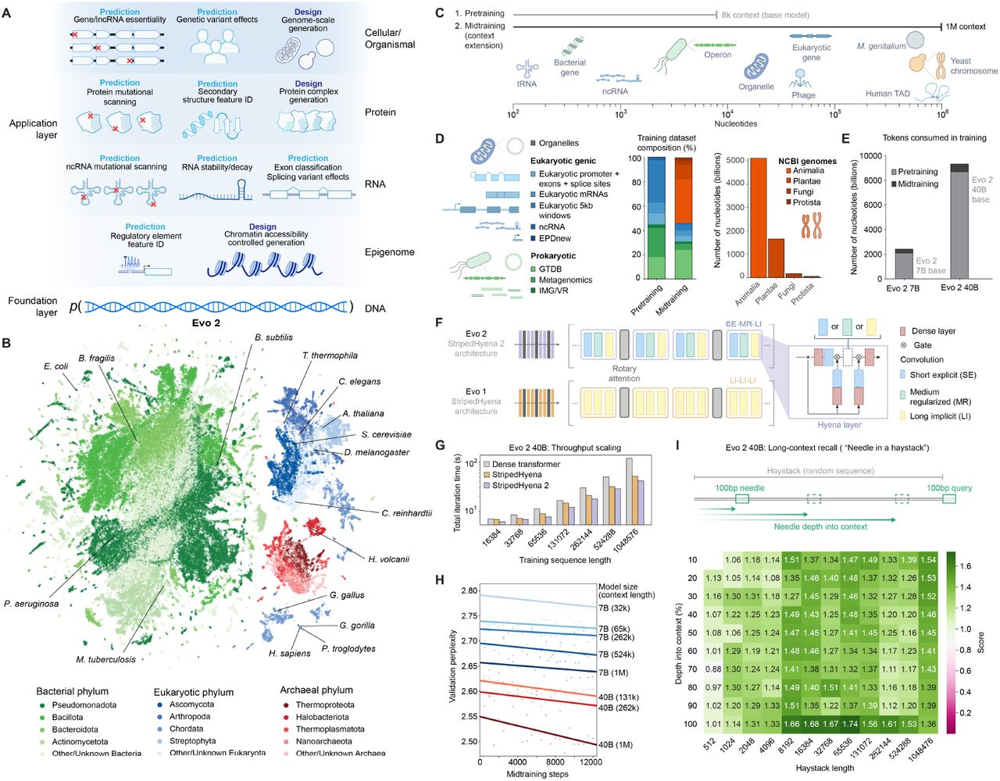
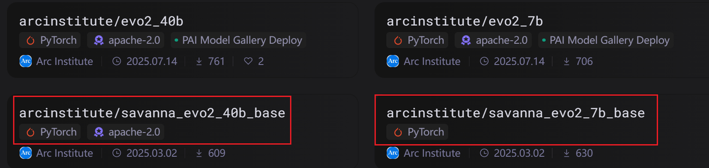

# <div align="center"><strong>Onescience for Evo2</strong></div>
## <div align="center">使用说明</div>


### 模型简介

Evo 2 是一种最先进的 DNA 语言模型，专为长上下文建模与设计而构建。该模型能够在单核苷酸分辨率下，对长达 100 万碱基对的上下文进行建模，基于 StripedHyena 2 架构实现。Evo 2 的预训练过程使用了 Savanna，并在 OpenGenome2 数据集上以自回归方式进行训练。该数据集涵盖了来自生命各领域的 8.8 万亿标记序列。

### 模型结构


### 数据集准备


OpenGenome2 官方提供了两种格式的数据，该数据集大小约 2.5T，OpenGenome2[数据下载地址](https://modelscope.cn/datasets/arcinstitute/opengenome2)：
1. 原始 FASTA 文件
  - 包含原始基因组序列，需要用户自行进行转录、反转录、互补、序列反转等预处理操作。
  - 适合需要 灵活处理 DNA 序列 的研究场景。
2. 预处理好的 JSON 文件
  - 官方已经对原始数据做了初步处理。
  - 用户只需进行 读取、tokenize、padding 等操作 即可直接使用。
  - 适合快速实验。

FASTA 文件需要额外的生物学相关处理，主要依赖 bionemo-noodles 包，该包是一个基于 noodles 的 Python 封装，扩展了 FAIDX（FASTA indexer），支持 内存映射（memmap），可高效地对 FASTA 文件进行随机访问。
 bionemo.noodles 的几个常用函数：
- back_transcribe_sequence: RNA → DNA 反转录
- transcribe_sequence: DNA → RNA 转录
- complement_sequence: DNA 序列互补链
- reverse_sequence: DNA 序列反转


使用 NvFaidx 可以快速索引和读取大规模基因组数据：
```python
from bionemo.noodles import back_transcribe_sequence, complement_sequence, reverse_sequence, transcribe_sequence
from bionemo.noodles.nvfaidx import NvFaidx

# Shell 脚本入口
bash evo2/tools/data_process/preprocess_data_fasta.sh

# Python 脚本入口
python evo2/tools/data_process/preprocess_data_fasta.py -c <CONFIG_PATH>
```

Json 文件：JSON数据只需要做轻量级处理，数据读取、tokenizer 转换、样本长度填充。

```python
python preprocess_data_json.py \
    --input "$INPUT_FILE" \
    --output-prefix "$OUTPUT_PREFIX" \
    --tokenizer-type CharLevelTokenizer \
    --dataset-impl mmap \
    --append-eod \
    --enforce-sample-length 8192 \
    --workers 8 \
    --log-interval 100
```

### 模型转换

- 将单个 PyTorch 或 ZeRO-1 的 checkpoint（.pt 文件）转换为 NeMo2 格式
- 模型转化的脚本位置
  `onescience/examples/biosciences/evo2/tools/checkpoint_convert/convert_to_nemo.py`
- 实用示例
  `python tools/checkpoint_convert/convert_to_nemo.py --model-path <CKPT_FILE> --output-dir <OUTPUT_DIR>  --model-size <MODEL_SIZE>`
  
#### 7B 脚本示例
```bash
srun python tools/checkpoint_convert/convert_to_nemo.py \
  --model-path checkpoint/evo2_savanna_7b/savanna_evo2_7b.pt \
  --output-dir /work/share/ac8hkycjba/osmodels/evo2/nemo_model/nemo_evo2_7b \
  --model-size 7b_arc_longcontext 
```

#### 注意事项

1. **模型权重来源**  
   - 官网提供了两种模型权重：**训练** 和 **推理**。  
   - 请务必下载并使用 **训练用权重**（前缀为 `savanna_` 的模型权重）。  

   

2. **`--model-size` 参数说明**  
   - 对于 7B 和 40B 的模型，需注意 `--model-size` 参数取值：  

   | 参数值               | 对应模型              |
   |----------------------|----------------------|
   | `7b`                 | `savanna_evo2_7b_base` |
   | `7b_arc_longcontext` | `savanna_evo2_7b`      |
   | `40b`                | `savanna_evo2_40b_base`|
   | `40b_arc_longcontext`| `savanna_evo2_40b`     |


 ### 训练
 `onescience/examples/biosciences/evo2/checkpoint`、`onescience/examples/biosciences/evo2/data`分别为模型和数据存放处，可用软连接将相应内容存放到该处

##### 环境安装
```shell
conda create -n your-name python=3.11 -y
pip install packages of constraints.txt
pip install -c constraints.txt .[bio]
```

 **单节点多卡训练**

需要加载dtk相关环境(以612为例)：

`source ~/dtk/dtk-25.04.1/env.sh`

`source ~/dtk/dtk-25.04.1/cuda/env.sh`

`module load compiler/gcc/12.2.0`

运行`onescience/examples/biosciences/evo2/train_single_node_evo2_7b.sh`脚本进行微调或从零训练。从零训练只需注释掉`ckpt-dir`参数即可

onescience中的evo2支持从零训练和微调，下面对重要参数进行介绍：
- 必要参数：训练脚本 `train_one_node.py`
- 必要参数：数据配置文件`the path of your data config`,具体格式可以参考config文件夹下示例
- dataset-dir：数据存放地址，和data config保持一致
- model-size：模型类型，可选有`1b,1b_nv,40b,40b_arc_longcontext,40b_nv,7b,7b_arc_longcontext,7b_nv,test,test_nv`
- devices：用到显卡数量
- ckpt-dir：预加载模型地址

```shell
python  $PROJECT_ROOT/examples/biosciences/evo2/train_one_node.py\
-d $PROJECT_ROOT/examples/biosciences/evo2/config/training_data_config.yaml\
--dataset-dir $PROJECT_ROOT/examples/biosciences/evo2/data/data_evo2_612\
--model-size 7b_arc_longcontext\
--devices 4 \
--seq-length 1024 \
--micro-batch-size 2 \
--lr 0.0001 \
--warmup-steps 5 \
--max-steps 1000 \
--clip-grad 1 \
--wd 0.01 \
--activation-checkpoint-recompute-num-layers 1 \
--val-check-interval 50 \
--ckpt-async-save\
--ckpt-dir $PROJECT_ROOT/examples/biosciences/evo2/checkpoint/evo2_1b\
```

**多节点多卡微调**

多节点多卡主要涉及sbatch配置文件`train_multi_node_slurm_evo2.sh`和执行文件`train_evo2.sh`：
```shell
train_multi_node_slurm_evo2.sh

#!/bin/bash
#SBATCH -J evo2_for_onescience # 集群项目名字
#SBATCH -p k100ai # 申请显卡型号
#SBATCH --nodes=4 # 使用节点个数
#SBATCH --ntasks-per-node=4 
#SBATCH --cpus-per-task=4
#SBATCH --gres=dcu:4 # 单节点使用显卡数
#SBATCH -o evo2/logs%j.out     # log地址，如需要二级目标，需要先手动建立文件夹 

# 612集群激活相关环境，508有所不同
source ~/dtk/dtk-25.04.1/env.sh
source ~/dtk/dtk-25.04.1/cuda/env.sh
module load compilers/gcc/12.2.0
source ~/conda.env
conda activate test-evo2env
unset ROCBLAS_TENSILE_LIBPATH 

DEVICES=${SLURM_GPUS_PER_NODE:-4}
echo "SLURM_JOB_NUM_NODES: $SLURM_JOB_NUM_NODES"
echo "SLURM_NTASKS_PER_NODE: $SLURM_NTASKS_PER_NODE" 

export NCCL_IB_HCA=mlx5_0
export NCCL_SOCKET_IFNAME=ib0
export HSA_FORCE_FINE_GRAIN_PCIE=1
export OMP_NUM_THREADS=1
export HIP_VISIBLE_DEVICES=0,1,2,3 # 单节点卡数
export CUDA_DEVICE_MAX_CONNECTIONS=1

nodes=$(scontrol show hostnames $SLURM_JOB_NODELIST)
nodes_array=($nodes)

# 第一个节点的地址
master_addr=${nodes_array[0]}

# 主节点的端口（可以根据需要调整）
master_port=29500

# 在每个节点上启动 torchrun
echo SLURM_NNODES=$SLURM_NNODES
echo master_addr=$master_addr
echo master_port=$master_port

srun train_evo2.sh

```
```shell
train_evo2.sh 相关参数含义参考单节点

#!/bin/bash

MODEL_SIZE=1b
CP_SIZE=1
TP_SIZE=1
PP_SIZE=1
MICRO_BATCH_SIZE=2
GRAD_ACC_BATCHES=1
SEQ_LEN=512
MAX_STEPS=100
VAL_CHECK=50
CLIP_GRAD=250 # 梯度剪裁
EXTRA_ARGS="--enable-preemption --use-megatron-comm-overlap-llama3-8k --ckpt-async-save --overlap-grad-reduce --clip-grad $CLIP_GRAD --eod-pad-in-loss-mask"
EXTRA_ARG_DESC="BF16_perf_cg250_continue"
LR=0.0003
MIN_LR=0.00003
WU_STEPS=2500
# 0xDEADBEEF
SEED=1234
WD=0.1
ADO=0.01
HDO=0.01

# DEVICES=${SLURM_GPUS_PER_NODE:-4}
# echo "SLURM_JOB_NUM_NODES: $SLURM_JOB_NUM_NODES"
# echo "SLURM_NTASKS_PER_NODE: $SLURM_NTASKS_PER_NODE" 

PROJECT_ROOT=$(python -c "from pathlib import Path; print(Path(__name__).resolve().parents[5])")

echo "ONESCIENCE_PATH:" $PROJECT_ROOT

cd $PROJECT_ROOT/examples/biosciences/evo2/checkpoint/evo2-7b

DIRS=(
    "./lightning_logs"
    "./results"
)

for DIR in "${DIRS[@]}"; do
    if [ -d "$DIR" ]; then
        echo "Del Files: $DIR"
        rm -rf "$DIR"
    else
        echo "Files Not Exist: $DIR"
    fi
done

python $PROJECT_ROOT/examples/biosciences/evo2/train_slurm.py\
    -d $PROJECT_ROOT/examples/biosciences/evo2/config/training_data_config.yaml\
    --dataset-dir $PROJECT_ROOT/examples/biosciences/evo2/data/data_evo2_612\
    --model-size 7b_arc_longcontext \
    --devices 4 \
    --num-nodes 4 \
    --seq-length 1024 \
    --micro-batch-size 4 \
    --lr 0.0001 \
    --warmup-steps 5 \
    --max-steps 1000 \
    --clip-grad 1 \
    --wd 0.01 \
    --activation-checkpoint-recompute-num-layers 1 \
    --val-check-interval 50 \
    --ckpt-async-save\
    # --num-nodes=${SLURM_JOB_NUM_NODES} \
    # --devices=${DEVICES} \
    # --grad-acc-batches $GRAD_ACC_BATCHES \
    # --max-steps=$MAX_STEPS \
    # --seed $SEED \
    # ${EXTRA_ARGS} \
    # --lr $LR \
    # --wd $WD \
    # --min-lr $MIN_LR \
    # --warmup-steps $WU_STEPS \
    # --attention-dropout $ADO \
    # --hidden-dropout $HDO \
    # --limit-val-batches=20 \
    # --val-check-interval=${VAL_CHECK} \
    # --seq-length=${SEQ_LEN} \
    # --tensor-parallel-size=${TP_SIZE} \
    # --context-parallel-size=${CP_SIZE} \
    # --pipeline-model-parallel-size=${PP_SIZE} \
    # --micro-batch-size=${MICRO_BATCH_SIZE} \
    # --model-size=${MODEL_SIZE} \
    # --workers 10

```

#### 推理

#### 在超算互联网使用

#### 许可证

evo2项目（包括代码和模型参数）在[Apache 2.0](https://github.com/bytedance/Protenix/blob/main/LICENSE)许可下提供，可免费用于学术研究和商业用途。

