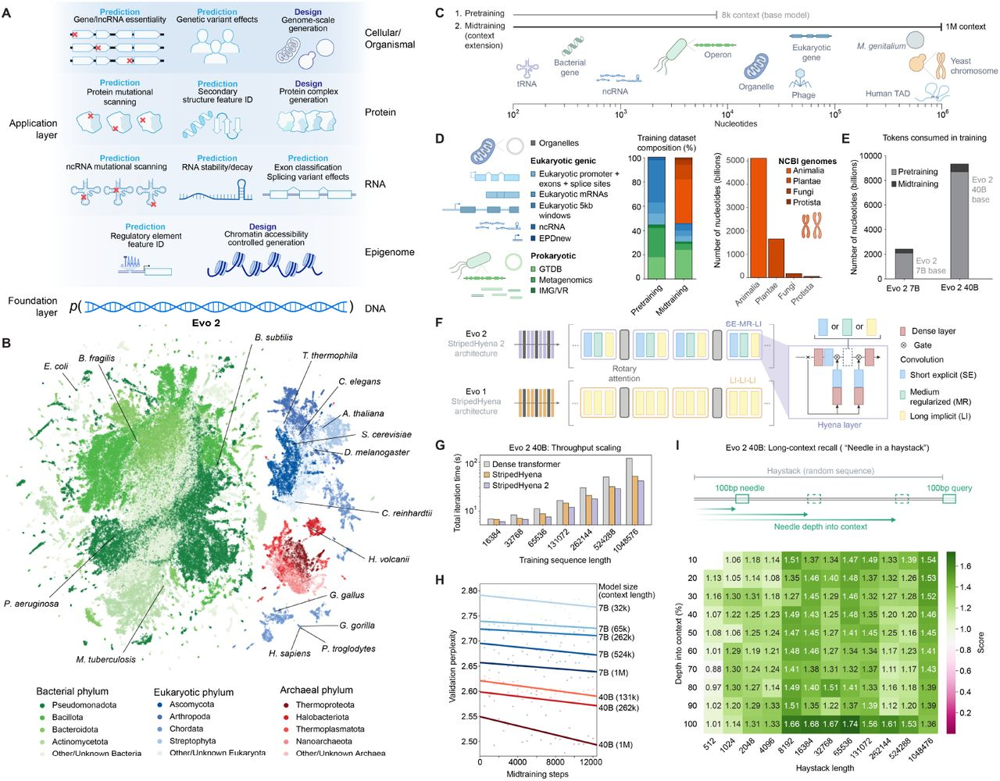

# Evo2 

本示例将 Evo2 基因组基础模型集成到 OneScience，提供基因组数据预处理、checkpoint 转换、单节点与多节点训练、自回归序列生成以及 FASTA 批量预测入口。

## 简介

Evo2 基于 StripedHyena 2 架构，在 OpenGenome2 数据集上训练，面向长上下文基因组序列建模。模型可用于 DNA 序列生成、序列对数概率计算、变异效应分析及下游微调。

- 论文：[Genome modeling and design across all domains of life with Evo 2](https://www.biorxiv.org/content/10.1101/2025.02.18.638918v1)
- 许可证：[Apache License 2.0](https://github.com/ArcInstitute/evo2/blob/main/LICENSE)



## 目录

- [目录结构](#目录结构)
- [环境准备](#环境准备)
- [数据准备](#数据准备)
- [Checkpoint 转换](#checkpoint-转换)
- [功能与入口](#功能与入口)
- [模型训练](#模型训练)
- [序列生成](#序列生成)
- [FASTA 批量预测](#fasta-批量预测)
- [输出与复现](#输出与复现)
- [运行约束](#运行约束)
- [Issues](#issues)
- [许可证与引用](#许可证与引用)

## 目录结构

```text
examples/biosciences/evo2/
├── config/
│   ├── genome_data_config.yaml          # 训练数据配置
│   ├── genome_preprocess_config.yaml    # FASTA 预处理配置
│   └── opengenome2.yml                  # OpenGenome2 配置示例
├── data/
│   └── prompts.csv                      # 示例提示序列
├── tools/
│   ├── checkpoint_convert/
│   │   └── convert_to_nemo.py           # PyTorch/Savanna 到 NeMo2 转换
│   ├── data_process/
│   │   ├── preprocess_data_fasta.py
│   │   ├── preprocess_data_fasta.sh
│   │   ├── preprocess_data_json.py
│   │   └── preprocess_data_json.sh
│   └── install_envs_constraints.sh
├── infer.py                             # 自回归 DNA 序列生成
├── predict.py                           # FASTA 序列 logits/对数概率预测
├── inference.sh                         # Slurm 推理示例
├── train_one_node.py                    # 单节点训练入口
├── train_slurm.py                       # 分布式训练入口
├── train_evo2_1b.sh                     # 1B 单节点配置示例
├── train_evo2_7b.sh                     # 7B 单节点配置示例
├── train_evo2.sh                        # torchrun 多节点入口
└── train_multi_node_slurm_evo2.sbatch   # Slurm 提交脚本
```

## 环境准备

在仓库根目录执行以下命令：

```bash
conda create -n onescience-evo2 python=3.11 -y
conda activate onescience-evo2
bash install.sh bio
source env.sh
```

当前示例要求与 OneScience Evo2 适配层兼容的 NeMo、Megatron Core、PyTorch 和 Transformer Engine 环境。

以下环境变量用于解析默认数据和模型路径：

```bash
export ONESCIENCE_DATASETS_DIR=/path/to/datasets
export ONESCIENCE_MODELS_DIR=/path/to/models
```

## 数据准备

OpenGenome2 数据规模约为 2.5 TB，可从 [ModelScope](https://modelscope.cn/datasets/arcinstitute/opengenome2) 获取。完整训练前应根据存储容量、文件系统吞吐和训练规模制定下载与预处理方案。

### FASTA 数据

FASTA 预处理入口读取 `genome_preprocess_config.yaml`，并生成训练所需的数据文件：

```bash
cd examples/biosciences/evo2
python tools/data_process/preprocess_data_fasta.py \
  --config config/genome_preprocess_config.yaml
```

`tools/data_process/preprocess_data_fasta.sh` 会下载人类参考基因组的 chr20、chr21 和 chr22 示例并启动预处理。该脚本需要网络访问、`wget` 和 `zcat`，适用于功能验证，不代表完整 OpenGenome2 预处理流程。

### JSON/JSONL 数据

预处理后的 JSON 或压缩 JSONL 数据可转换为 Megatron mmap 数据：

```bash
cd examples/biosciences/evo2
python tools/data_process/preprocess_data_json.py \
  --input /path/to/train.jsonl.gz \
  --output-prefix /path/to/output/train \
  --tokenizer-type CharLevelTokenizer \
  --dataset-impl mmap \
  --append-eod \
  --workers 8 \
  --log-interval 100
```

`preprocess_data_json.sh` 包含集群路径示例。运行前需修改 `INPUT_DIR` 和 `OUTPUT_DIR` 。

训练配置中的数据前缀必须与预处理输出一致。训练启动前应确认 `.bin`、`.idx` 及数据配置引用的文件全部存在。

## Checkpoint 转换

训练与推理入口加载 NeMo2 checkpoint。Savanna/PyTorch 权重需先执行转换：

```bash
cd examples/biosciences/evo2
python tools/checkpoint_convert/convert_to_nemo.py \
  --model-path /path/to/savanna_evo2_7b.pt \
  --output-dir ${ONESCIENCE_MODELS_DIR}/evo2/evo2_nemo_7b \
  --model-size 7b_arc_longcontext
```

`--model-path` 支持未分片的 MP1 checkpoint，也支持 `hf://` 形式的 Savanna Evo2 模型标识。`--model-size` 必须与权重架构一致。

| `--model-size` | 对应架构 |
|----------------|----------|
| `1b` | Evo2 1B base |
| `7b` | Evo2 7B base |
| `7b_arc_longcontext` | Evo2 7B 长上下文版本 |
| `40b` | Evo2 40B base |
| `40b_arc_longcontext` | Evo2 40B 长上下文版本 |

转换完成后，目标目录需包含 NeMo2 checkpoint 元数据和模型分片。Savanna `.pt` 文件不能直接传给 `infer.py` 或 `predict.py`。

## 功能与入口

| 任务 | 推荐入口 | 输入 | 输出 |
|------|----------|------|------|
| FASTA 预处理 | `tools/data_process/preprocess_data_fasta.py` | FASTA 和 YAML 配置 | 训练数据文件 |
| JSON 数据转换 | `tools/data_process/preprocess_data_json.py` | JSON/JSONL | Megatron mmap 数据 |
| Checkpoint 转换 | `tools/checkpoint_convert/convert_to_nemo.py` | Savanna/PyTorch 权重 | NeMo2 checkpoint |
| 单节点训练 | `train_one_node.py` | mmap 数据和数据配置 | Lightning/NeMo checkpoint |
| 多节点训练 | `train_multi_node_slurm_evo2.sbatch` | Slurm 资源和训练配置 | 分布式训练 checkpoint |
| DNA 序列生成 | `infer.py` | NeMo2 checkpoint 和 prompt | 生成序列或文本文件 |
| FASTA 批量预测 | `predict.py` | FASTA 和 NeMo2 checkpoint | logits、对数概率和索引映射 |

所有相对路径命令均假定当前目录为 `examples/biosciences/evo2`。

## 模型训练

### 单节点训练

以下命令展示 7B 长上下文架构的单节点训练参数。批大小、序列长度和并行设置必须根据设备显存调整。

```bash
cd examples/biosciences/evo2
python train_one_node.py \
  -d config/genome_data_config.yaml \
  --dataset-dir ${ONESCIENCE_DATASETS_DIR}/evo2/data_mini/genome_data \
  --model-size 7b_arc_longcontext \
  --devices 4 \
  --num-nodes 1 \
  --seq-length 8192 \
  --micro-batch-size 2 \
  --lr 1e-4 \
  --warmup-steps 5 \
  --max-steps 1000 \
  --clip-grad 1 \
  --wd 0.01 \
  --activation-checkpoint-recompute-num-layers 1 \
  --val-check-interval 50
```

从已有 NeMo2 checkpoint 继续训练时，增加 `--ckpt-dir /path/to/checkpoint`。从头训练时不设置该参数。

`train_evo2_1b.sh` 和 `train_evo2_7b.sh` 提供固定参数示例。执行前需检查设备数量、模型规格、数据路径、序列长度和输出目录。

### 多节点训练

多节点训练通过 Slurm 提交脚本启动：

```bash
cd examples/biosciences/evo2
sbatch train_multi_node_slurm_evo2.sbatch
```

提交前必须根据集群环境配置以下项目：

- Slurm 分区、节点数、每节点设备数和日志目录；
- `MASTER_ADDR`、`MASTER_PORT` 和网络接口；
- `SLURM_GPUS_PER_NODE`、`HIP_VISIBLE_DEVICES` 或 `CUDA_VISIBLE_DEVICES`；
- 数据目录、模型规格及张量、流水线、上下文并行度；
- checkpoint 保存目录和恢复策略。

`train_evo2.sh` 使用 `torchrun` 启动 `train_slurm.py`。模型并行度与数据并行度必须与申请的设备资源一致。

## 序列生成

`infer.py` 根据 DNA prompt 执行自回归生成：

```bash
cd examples/biosciences/evo2
python infer.py \
  --ckpt-dir ${ONESCIENCE_MODELS_DIR}/evo2/evo2_nemo_7b \
  --prompt ATGCGT \
  --max-new-tokens 1024 \
  --temperature 1.0 \
  --top-k 0 \
  --top-p 0.0 \
  --seed 1234 \
  --output-file result.txt
```

主要参数如下：

| 参数 | 默认值 | 说明 |
|------|--------|------|
| `--ckpt-dir` | 必填 | NeMo2 checkpoint 目录 |
| `--prompt` | 大肠杆菌谱系标签 | 生成起始序列或谱系提示 |
| `--max-new-tokens` | `1024` | 最大生成 token 数 |
| `--temperature` | `1.0` | 采样温度 |
| `--top-k` | `0` | Top-k 采样阈值 |
| `--top-p` | `0.0` | Top-p 采样阈值 |
| `--seed` | 未设置 | 随机种子 |
| `--ckpt-format` | `torch_dist` | Checkpoint 格式；`zarr` 已弃用 |
| `--tensor-parallel-size` | `1` | 张量并行度 |
| `--pipeline-model-parallel-size` | `1` | 流水线并行度 |
| `--context-parallel-size` | `1` | 上下文并行度 |
| `--fp8` | 关闭 | 启用 vortex 风格 FP8 |
| `--flash-decode` | 关闭 | 启用 Flash Decode |

并行度乘积不得超过可见设备数。`inference.sh` 内部使用 `srun`，仅适用于 Slurm 环境；非 Slurm 环境应直接执行 `python infer.py`。

## FASTA 批量预测

`predict.py` 对 FASTA 序列执行单步预测，可保存 logits、逐序列对数概率和输入索引映射：

```bash
cd examples/biosciences/evo2
python predict.py \
  --fasta /path/to/sequences.fa \
  --ckpt-dir ${ONESCIENCE_MODELS_DIR}/evo2/evo2_nemo_7b \
  --output-dir ./predict_outputs \
  --model-size 7b_arc_longcontext \
  --batch-size 1 \
  --output-log-prob-seqs \
  --log-prob-collapse-option mean
```

`--model-size`、并行参数和 checkpoint 架构必须一致。启用 `--fp8` 或 `--full-fp8` 会改变数值精度，进行结果比较时必须记录相关设置。

## 输出与复现

每次训练或推理应记录以下信息：

- Git commit、Python 环境和关键依赖版本；
- checkpoint 路径、格式和模型规格；
- 数据版本、数据配置和预处理参数；
- 序列长度、批大小及模型并行参数；
- 随机种子、采样温度、Top-k 和 Top-p；
- 可见设备、设备类型及精度设置；
- 输出目录和完整启动命令。

生成序列应校验字符集合、长度和终止标记。对数概率结果仅能在相同模型、tokenizer、序列处理和归一化设置下进行比较。

## 运行约束

- Evo2 训练和推理需要 GPU/DCU 设备，模型规模和序列长度对显存需求影响显著。
- 长上下文模型的架构参数、checkpoint 和 `--model-size` 必须严格匹配。
- `preprocess_data_fasta.sh` 包含联网下载步骤；离线环境应预先准备 FASTA 文件并直接调用 Python 入口。
- `preprocess_data_json.sh` 包含特定集群路径，执行前必须完成路径替换。
- 多节点脚本包含集群相关环境变量，不应未经审核直接提交到其他集群。
- 模型输出属于计算预测，涉及生物学结论时必须结合实验数据和专业分析进行验证。

## Issues

- 运行过程中若出现 " ImportError: cannot import name 'BaseStore' from 'zarr.storage' "相关问题，可通过 pip install "zarr<3.0"解决。
- 运行过程中若出现 " 'ml_dtypes' has no attribute 'float4_e2m1fn'"问题，可升级ml_dtypes版本解决，例如：pip install "ml_dtypes>=0.5.0" 。
- 运行过程中若出现 " cannot import name 'TRANSFORMERS_CACHE' from 'transformers' ", 需检查transforms版本是否符合需求，例如可使用 transformers 4.56.2 版本。

## 许可证与引用

Evo2 代码和模型参数采用 [Apache License 2.0](https://github.com/ArcInstitute/evo2/blob/main/LICENSE)。使用本示例开展研究时，应同时遵循数据集、模型权重及 OneScience 的许可证要求，并引用 Evo2 原始论文。