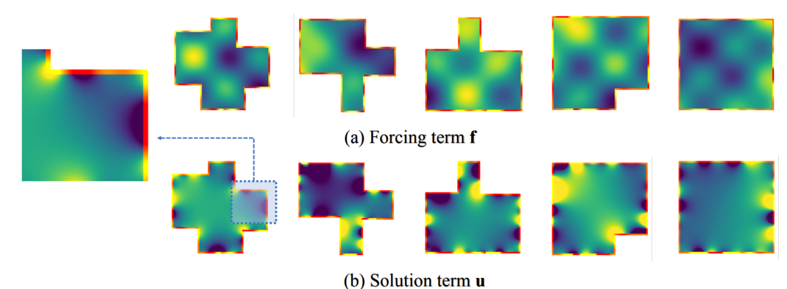
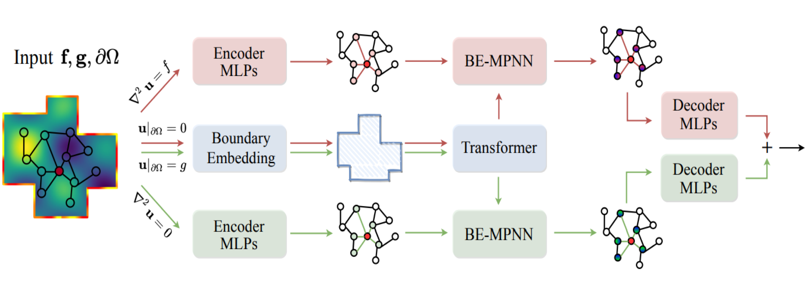

# BENO: 求解椭圆偏微分方程的边界嵌入神经算子

边界嵌入神经算子（BENO）是一个新型的算子网络，该算子将**复杂边界形状**和**非均匀边界值**合并到椭圆偏微分方程的求解中，如下所示：

<p align="center">

<br><br>
</p>

BENO模型架构如下所示：


<p align="center">

<br><br>
</p>

## 数据集

10 个 4-Corners 例题的样本数据集文件位于 "data/" 目录下。完整的数据集文件可以通过[此链接](https://drive.google.com/file/d/11PbUrzJ-b18VhFGY_uICSciCkeGrsaTZ/view)下载。要在特定边界类型上运行实验，请将链接中的文件下载到本地仓库的 "data/" 文件夹中。**BC_Nxx_xc_all.npy**/**RHS_Nxx_xc_all.npy**/**SOL_Nxx_xc_all.npy** 分别代表特定分辨率和形状的**边界信息**/**源项**/**解项**。

除此之外，我们还提供了精简的数据集，它位于data目录下，仅包含10组数据，用于做快速训练和推理。

将数据集解压后放入当前目录下的data文件夹中，就像这样

```
▼ data/
    ► Dirichlet/
    ► Neumann/
analysis.py
train.py
run_beno.ipynb
README.md
```

## 训练

使用以下命令训练BENO，具体使用哪个数据集可以在代码中更改

```code
python train.py --dataset_type=32x32 --epochs 1000
```

运行`python train.py -h`可以查看各参数作用

## 预测

要分析结果，请使用以下命令：

```code
python analysis.py 
```

## 参考文献:

[Paper](https://openreview.net/forum?id=ZZTkLDRmkg) | [arXiv](https://arxiv.org/abs/2401.09323) | [Tweet](https://twitter.com/tailin_wu/status/1747259448635367756)

[Haixin Wang*](https://willdreamer.github.io/), [Jiaxin Li*](https://github.com/Jiaxinlia/Jiaxin.github.io), [Anubhav Dwivedi](https://dwivedi-anubhav.github.io/website/), [Kentaro Hara](https://aa.stanford.edu/people/ken-hara), [Tailin Wu](https://tailin.org/)

