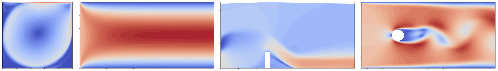
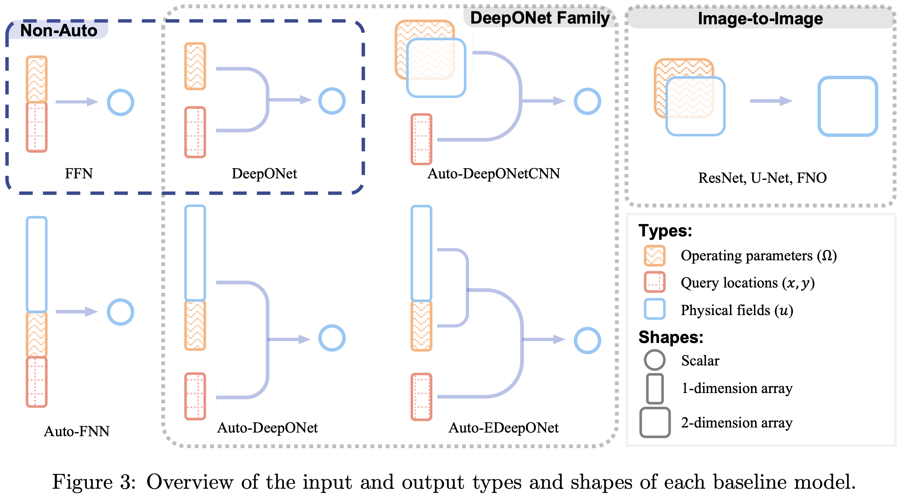

<h1 align="center">CFDBench</h1>

<div></br></div>



CFDBench 是一个用于评估在具有各种边界条件、物理特性和域几何形状的流体动力学中机器学习方法的大规模基准。它由计算流体动力学（CFD）中的四个经典问题组成，具有许多不同的操作参数，使其非常适合测试替代模型的推理时间泛化能力。这种泛化能力对于在将替代模型应用于新问题时避免昂贵的重新训练至关重要。

## 数据集

数据集中包括的四个流动问题，对于每个问题，我们生成具有不同操作参数的流动，这是我们用来指三种条件的组合的术语：(1)边界BC，(2)流体物理性质(PROP)，和(3)场的几何形状(GEO)。每种运行参数对应一个子集。在每个子集中，相应的操作条件是变化的，而其他参数保持不变。
数据使用npy文件存储，是NumPy 使用的标准二进制文件格式。每组数据下包含u.npy和v.npy以及一个json文件（用于描述这组数据对应的物理条件）

用数值算法生成数据后，将其插值到64x64的网格中，插值前的原始数据非常大。下面的链接是插值数据：
插值数据 (~13.4GB):

- [HuggingFace](https://huggingface.co/datasets/chen-yingfa/CFDBench)

原始数据 (~460GB):

- [HuggingFace](https://huggingface.co/datasets/chen-yingfa/CFDBench-raw)
- [Baidu Drive (百度网盘)](https://pan.baidu.com/s/1p0q60cv2hFZ7UcIf3XKSaw?pwd=cfd4) (提取码: cfd4)


### 数据生成

`generation-code`中目录包含创建网格的代码（ICEM代码）和ANSYS Fluent中批量生成的模式代码。

### 数据准备
将下载的数据移动到`data`目录中，就像这样

```
▼ data/
    ▼ cavity/
        ▼ bc/
        ▼ geo/
        ▼ prop/
    ► tube/
    ► dam/
    ► cylinder/
args.py
train_auto.py
train.py
README.md
```

## 模型



模型的基本类型是自回归和非自回归：

- 自回归:
    - Auto-FFN
    - Auto-DeepONet
    - Auto-EDeepONet
    - Auto-DeepONetCNN
    - ResNet
    - U-Net
    - FNO

- 非自回归
    - FFN
    - DeepONet

### 模型训练

运行`train.py`或`train_auto.py`分别训练非自回归或自回归模型。使用`--model`指定模型，它必须是以下之一：

Model | Value for `--model` | Script
--- | --- | ---
Non-autoregrssive FFN | `ffn` | `train.py`
Non-autoregressive DeepONet | `deeponet` | `train.py`
Autoregressive Auto-FFN | `auto_ffn` | `train_auto.py`
Autoregressive Auto-DeepONet | `auto_deeponet` | `train_auto.py`
Autoregressive Auto-EDeepONet | `auto_edeeponet` | `train_auto.py`
Autoregressive Auto-DeepONetCNN | `auto_deeponet_cnn` | `train_auto.py`
Autoregressive ResNet | `resnet` | `train_auto.py`
Autoregressive U-Net | `unet` | `train_auto.py`
Autoregressive FNO | `fno` | `train_auto.py`

#### 模型训练示例


例如，使用FNO模型模拟方腔流子集中的所有子集：
```bash
python train_auto.py --model fno --data_name cavity_prop_bc_geo
```
使用DeepONet模型模拟坝流中的 PROP + GEO 子集：

```bash
python train.py --model deeponet --data_name dam_prop_geo
```
默认情况下，结果将保存到`./result/`目录，但可以使用`--output_dir`参数进行自定义。

如需更多选项，如模型超参数，请运行`python train.py -h`或`python train_auto.py -h`。

注：在cylinder数据集中使用自回归模型训练时，会生成当前目录下生成dataset目录，用于存储预处理后的数据，这样在使用其他模型时能直接读取。

### 模型推理

运行`train.py` 或 `train_auto.py`时使用`--mode test`参数

## 参考文献

[CFDBench: A Large-Scale Benchmark for Machine Learning Methods in Fluid Dynamics](https://arxiv.org/abs/2310.05963).
