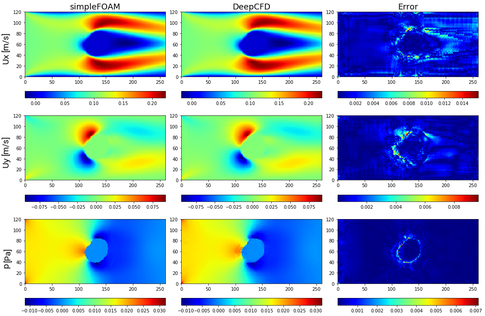
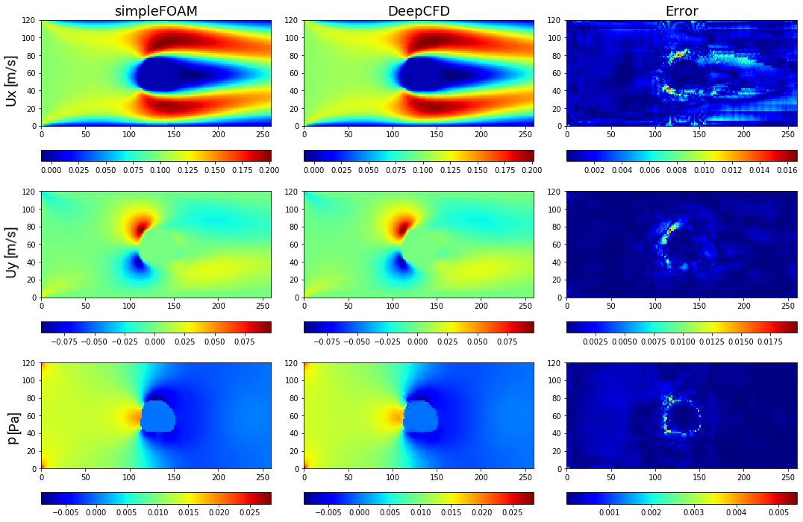
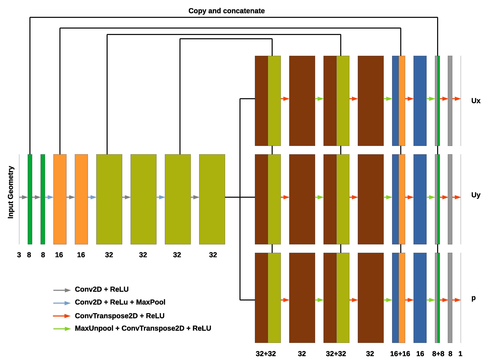

# DeepCFD

这是一个基于CNN网络用于模拟非均匀稳定层流示例，基于
[DeepCFD: Efficient Steady-State Laminar Flow Approximation with Deep Convolutional Neural Networks](https://arxiv.org/abs/2004.08826)工作。它模拟了含有不同障碍物的管道流动。

## 问题描述
通过数值求解纳维-斯托克斯方程的计算流体动力学（CFD）仿真，在工程应用领域中是一个必不可少的工具。然而，对于实际流体问题，例如在气动外形优化中，CFD程序所需的计算成本和内存需求会变得非常高。这一高昂的成本与流体流动控制方程的复杂性相关联，其中包括难以解决的非线性偏微分项，这导致了长时间的计算，限制了设计方案迭代速度。因此，我们提出了DeepCFD：一个基于卷积神经网络（CNN）的模型，它能有效地为非均匀稳定层流的问题提供近似解。该提议的模型能够直接从用最先进CFD代码生成的真实数据中学习纳维-斯托克斯方程的完整解，包括速度场和压力场。使用DeepCFD，我们发现在低误差率的情况下，相比传统CFD方法，速度提高了最多三个数量级。

## 数据集和代码

此项目的数据集可以使用以此链接[下载](https://zenodo.org/record/3666056/files/DeepCFD.zip?download=1)

该文件夹包含文件 dataX 和 dataY，其中第一个文件提供了981个管道流样本的几何输入信息，而dataY文件则提供了这些样本的真实CFD解，包括使用simpleFOAM求解器得到的速度（Ux和Uy）场和压力（p）场。图1详细描述了每个文件的结构。

<p align="center">

<br><br>
<b>图 1.</b> DeepCFD 数据集结构
</p>

数据集dataX和dataY具有相同的维度(Ns, Nc, Nx, Ny)，其中第一维是样本数(Ns)，第二维是通道数(Nc)，第三和第四维分别是x方向和y方向上的元素数目(Nx和Ny)。对于输入数据dataX，第一个通道是从障碍物表面计算的符号距离函数(SDF)，第二个通道是多标签流体区域通道，第三个通道是从顶部/底部表面计算的符号距离函数(SDF)。对于输出数据dataY文件，第一个通道是水平速度分量Ux，第二个通道是垂直速度分量Uy，第三个通道是压力场。

模型结构：支持UNet, UNetEx 和 AutoEncoder三种，具体可以onescience/src/models/deepcfd中可查。

工具组件：比如结果可视化等，具体可在onescience/src/utils/deepcfd中可查。

### 模型结构

该项目中包括单解码器和多解码器的 “AutoEncoder” 及 “UNet” 架构，具体细节可参考[原论文](https://arxiv.org/abs/2004.08826)。


## 训练

单卡训练：
```
Usage:  python3 deepcfd.py [OPTIONS]

Options:
    -d, --device        TEXT  device: 'cpu', 'cuda', 'cuda:0', 'cuda:0,cuda:1' (default: cuda if available)
    -n, --net           TEXT  network architecture: UNetEx or AutoEncoder (default: UNetEx)
    -mi, --mmodel-input PATH  input dataset with sdf1,flow-region and sdf2 fields (default: dataX.pkl)
    -mo, --model-output PATH  output dataset with Ux,Uy and p (default: dataY.pkl)
    -o, --output        PATH  model output (default: mymodel.pt)
    -k, --kernel-size   INT   kernel size (default: 5)
    -f, --filters       TEXT  filter size (default: 8,16,32,32)
    -l, --learning-rate FLOAT learning rage (default: 0.001)
    -e, --epochs        INT   number of epochs (default: 1000)
    -b, --batch-size    INT   training batch size (default: 32)
    -p, --patience      INT   number of epochs for early stopping (default: 300)
    -v, --visualize           flag for visualizing ground-truth vs prediction plots (default: False)


Example:

python deepcfd.py \
        --net UNetEx \
        --model-input DeepCFD/$dataX.pkl \
        --model-output DeepCFD/dataY.pkl \
        --output DeepCFD/${name}.pt \
        --kernel-size 5 \
        --filters 8,16,32,32 \
        --epochs 2000 \
        --batch-size 32 > log.deepcfd

```

多卡训练：

```bash
mpirun -np <num_GPUs> --allow-run-as-root python deepcfd.py
```
若在 Docker 容器内运行，多GPU命令可能需加 `--allow-run-as-root`。

torchrun启动多节点多卡训练：

```bash
torchrun --standalone --nnodes=<num_nodes> --nproc_per_node=<num_GPUs> main.py
```

如果在支持slurm作业调度系统的环境下进行跨节点并行训练，可以执行如下脚本：

```bash
sbatch slurm.sh
```

## 可视化 - OpenFOAM vs DeepCFD

图2-图3展示了不同形状的管道流样本的预测结果，并与OpenFOAM求解的结果做了对比。图2-图3显示了圆形管道流的预测结果


<p align="center">

<br><br>
<b>图 2.</b> CFD（simpleFOAM）真实结果与 DeepCFD 预测结果的对比，展示速度分量和压力场，以及基于基于圆形形状1的流场绝对误差
</p>

<p align="center">

<br><br>
<b>图 3.</b> CFD（simpleFOAM）真实结果与 DeepCFD 预测结果的对比，展示速度分量和压力场，以及基于圆形形状2的流场绝对误差
</p>


## DeepCFD 网络结构

图4显示了DeepCFD的U-Net架构:
<p align="center">

<br><br>
<b>图 4.</b> DeepCFD U-Net 架构
</p>

## 文章链接

Paper: https://arxiv.org/abs/2004.08826  


