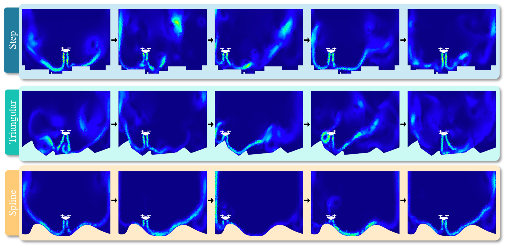
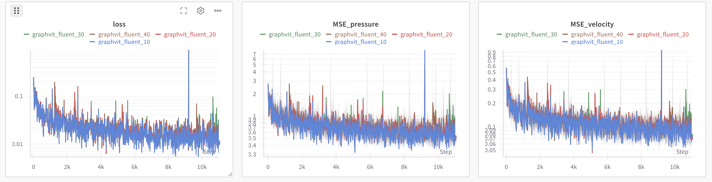

# EAGLE: Large-scale Learning of Turbulent Fluid Dynamics with Mesh Transformers


## 摘要

传统上，流体动力学的估计通过解纳维-斯托克斯方程的数值模拟和积分实现，这在高端硬件上依然计算复杂且耗时极大。该问题极具挑战，近期通过机器学习，尤其是图神经网络(GNN)及其变体，在静态场景中固定几何体数据集上进行了训练和评估。我们试图突破现有方法的复杂度限制，提出了一个新的模型、方法和基准。

本项目介绍了 **EAGLE**，一个包含约110万个二维网格的大规模数据集，数据来源于由移动流源与非线性场景结构相互作用产生的非稳态流体动力学模拟。数据涵盖600个不同的三种类型场景。

为在这个具有挑战性的数据集上预测压力和速度，我们设计了一个新的网格变换器，结合了节点聚类、图池化和全局注意力机制，以在一次迭代中学习跨空间距离较远点之间的长距离依赖，而非传统GNN需要多次迭代。实验显示该方法在合成和真实数据集及EAGLE上均优于现有最先进方法。


---

## 数据集

Eagle数据集中模拟了一架二维无人机在具有不同地面轮廓的二维场景中飞行时产生的复杂气流。尽管场景的几何形状在变化，无人机的轨迹保持不变：无人机从场景中心起飞，并在靠近地面表面悬停。在飞行过程中，两个螺旋桨高速产生的气流相互作用，并与场景结构产生复杂的湍流。为了产生各种不同的模拟结果，我们通过对一定范围内随机采样的点进行插值，程序性地生成大量地面轮廓。插值阶数的选择会导致截然不同的地面轮廓，从而使每次模拟产生完全不同的结果。EAGLE 数据集包含三种主要的几何类型，根据插值方式不同（见下图）：（i）阶梯型（Step）：表面点使用阶梯函数（零阶插值）连接，这会产生非常陡峭的角度，当无人机在阶梯上方悬停时，气流变化剧烈；（ii）三角型（Triangular）：表面点使用线性函数（一阶插值）连接，导致场景中不同位置出现许多小涡流；（iii）样条型（Spline）：表面点使用带平滑边界的样条函数连接，产生长且快速的气流尾迹，偶尔形成复杂的涡流结构。

<p align="center">

<br><br>
<b></b> Eagle数据集
</p>

你可以从[此链接](https://datasets.liris.cnrs.fr/eagle-version1)下载数据集。

模拟数据存储在单个numpy文件(.npz)中，包含二维节点位置、类型、速度和压力信息。边信息存储在另一个文件(`triangles.npy`)中，为三角形顶点三元组。以下为各文件对应的SHA256校验和：

```
f1bbc1dc22b0fbc57a5f8d0243d85f6471c43585fb0ecc7409de19996d3de12c  eagle_clusters.tar.gz
f73cb9a443011646fb944e0a634a0d91c20b3d71a8b4d89d55486f9e99bdca78  spline.tar.gz
ac04d3efb539a80d8538fb8214228652b482ab149fc7cc9ecf0b6d119e3b1be7  step.tar.gz
59a2ae96ca5ade7d3772e58b302c4132e1ee003ac239b7e38973ceb480a979e6  triangular.tar.gz
```

将下载的数据移动到`Eagle_dataset`目录中，就像这样:

```
EagLe_dataset/
├── Cre/
│   ├── 1/
│   │   ├── 1/
│   │   │   ├── constrained_kmeans_10.npy
│   │   │   ├── constrained_kmeans_20.npy
│   │   │   ├── constrained_kmeans_30.npy
│   │   │   ├── constrained_kmeans_40.npy
│   │   │   ├── sim.npz
│   │   │   └── triangles.npy
│   │   ├── 2/
│   │   └── ...
│   ├── 2/
│   └── ...
├── Spl/
└── Tri/
```

constrained_kmeans_xx.npy是使用clusterize_eagle.py生成的聚类数据，聚类数量分别为10,20,30,40。

---

## 训练

使用以下命令训练模型：

```bash
python train_graphvit.py --dataset-path XX --cluster-path XX --model-name "graphvit_10" --output-path "trained_models/graphvit" --n-cluster=10
```

以下为预训练模型的训练曲线截图（供参考）：

<p align="center">

<br><br>
<b>图 1.</b> 训练曲线
</p>

<p align="center">

<br><br>
<b>图 1.</b> 验证曲线
</p>

注意：此脚本需要预先计算好的聚类数据，聚类文件可从数据集主页下载。如果需要，也可以用脚本 `clusterize_eagle.py` 重新生成聚类：

```bash
python clusterize_eagle.py --max_cluster_size XXX --geom "Spl" --traj 1
```

多卡训练：

```bash
mpirun -np <num_GPUs>  python train_graphvit.py
```
若在 Docker 容器内运行，多GPU命令可能需加 `--allow-run-as-root`。

torchrun启动多节点多卡训练：

```bash
torchrun --standalone --nnodes=<num_nodes> --nproc_per_node=<num_GPUs> train_graphvit.py
```

如果在支持slurm作业调度系统的环境下进行跨节点并行训练，可以执行如下脚本：

```bash
sbatch slurm.sh
```


---

## 评估

可使用 `eval_graphvit.py` 脚本评估预训练模型。

本论文使用的指标是压力和速度场的归一化均方误差（Normalized MSE）：

$$ 
\text{N-RMSE}(T) =  \frac{1}{TB}\sum_{b=1}^B \sum_{t=1}^T\frac{1}{N_b} \sum_{n=1}^{N_b} \frac{\|v_n^b(t) - \hat v_n^b(t)\|_2}{\|\sigma_v\|_2} + \frac{\|p_n^b(t) - \hat p_n^b(t)\|_2}{\|\sigma_p\|_2}
$$

其中：
- $B$：批次数目，索引为 $b$
- $T$：时间步数，索引为 $t$
- $N_b$：第 $b$ 个批次中的节点数，索引为 $n$
- $v_n^b(t)$ 和 $p_n^b(t)$：真实速度与压力
- $\hat v_n^b(t)$ 和 $\hat p_n^b(t)$：预测速度与压力
- $\sigma_v$ 和 $\sigma_p$：速度和压力的标准差（硬编码于数据加载器）

```bash
python eval_graphvit.py --ckpt "./trained_models/graphvit/graphvit_10.nn" --dataset-path ./Eagle_dataset --cluster-path ./Eagle_dataset --n-cluster 10
100%|██████████████████| 118/118 [10:54<00:00,  5.55s/it, error_1=0.0811, error_50=0.352, error_250=0.634]
```

---

## 可视化结果

如果想复现项目页中的视频，可使用 `misc` 文件夹下的生成脚本：

```bash
python misc/export_video.py
```

它将为 EAGLE 数据集生成视频。

---

## 参考文献:

[EAGLE: Large-scale Learning of Turbulent Fluid Dynamics with Mesh Transformers](https://openreview.net/forum?id=ZZTkLDRmkg) | [arXiv](https://arxiv.org/abs/2302.10803) | [dataset](https://datasets.liris.cnrs.fr/eagle-version1)

