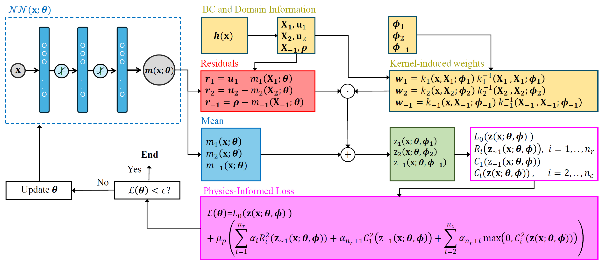

# 基于物理信息高斯过程的拓扑优化  

这是一种基于高斯过程（Gaussian Processes, GPs）框架的新型拓扑优化方法，其均值函数通过深度神经网络参数化。本实现参照论文 [Simultaneous and Meshfree Topology Optimization with Physics-informed Gaussian Processes](https://arxiv.org/abs/2408.03490) 的开源模型构建。


## 模型原理

我们在所有设计变量和状态变量上都施加高斯过程先验，以将它们表示为参数化的连续函数。这些高斯过程共享一个深度神经网络作为均值函数，但每个状态变量和设计变量都有各自独立的核函数。我们在一个单独的循环中统一估计模型的所有参数，优化目标是一个带有惩罚项的性能指标，其中的惩罚项对应于状态方程和设计约束。

<p align="center">

<br><br>
<b></b> 模型流程图
</p>


### 模型特点
1. **同时优化 (Simultaneous)**  
   - 将设计变量（材料密度 ρ）和状态变量（如流速 u, 压力 p）联合参数化
   - 在单循环中同时优化目标函数与物理约束（状态方程）
   - 消除传统嵌套循环（设计-分析-更新）

2. **无网格 (Meshfree)**  
   - 通过连续函数表示场变量，避免空间离散
   - 使用配点法（Collocation Points）近似积分计算
   - 天然规避网格依赖性/棋盘格问题

3. **物理信息高斯过程**  
   $$
   \mathbf{z}(\mathbf{x}; \boldsymbol{\zeta}) = [\mathbf{u}(\mathbf{x}), \rho(\mathbf{x})]
   $$
   - **共享均值函数**: 深度神经网络统一参数化所有变量
   - **独立核函数**: 每个变量拥有独立高斯过程核
   - **边界条件硬约束**: 通过核加权残差精确满足边界条件

### 优化框架
损失函数融合目标项与惩罚项：
$$
\mathcal{L}(\boldsymbol{\theta}) = L_o(\cdot) + \mu_p \left( \sum \alpha_i R_i^2 + \alpha_{vol} C_{vol}^2 \right)
$$

- **目标项** $L_o$: 最小化耗散功率（Stokes流案例）
- **惩罚项**:
  - $R_i$: 状态方程残差（动量/连续性方程）
  - $C_{vol}$: 体积约束残差
- **自适应机制**:
  - 动态损失加权（平衡不同约束尺度）
  - 惩罚系数递增策略（$\mu_p$ 从1增至500）

## 案例研究（Stokes流优化）

### 统一问题描述
$$
\begin{align*}
\text{目标：} & \min \mathcal{J} = \frac{1}{2} \int_{\Omega} \left( \nabla\mathbf{u}:\nabla\mathbf{u} + \kappa^{-1} \|\mathbf{u}\|^2 \right) d\Omega \\
\text{约束：} & \int_{\Omega} \rho d\Omega = V \\
& \text{Brinkman方程（低速粘性流）}
\end{align*}
$$
渗透率映射：$\kappa^{-1}(\rho) = \kappa_{max}^{-1} + (\kappa_{min}^{-1} - \kappa_{max}^{-1}) \rho \frac{1+q}{\rho+q}$

### 案例介绍
四个案例均以**最小化流体耗散功率**为目标，在**不同边界条件**下生成独特拓扑结构：
1. **Rugby（橄榄球）**：单入口单出口对称布局，形成中部收缩的橄榄球状流道  
2. **Pipe Bend（弯管）**：正交入口出口配置，优化出90°高效转向通道  
3. **Diffuser（扩散器）**：窄入口宽出口设计，生成渐扩式扩散结构  
4. **Double Pipe（双管道）**：双入口双出口系统，创造并行流道拓扑  

<p align="center">

<br><br>
<b></b> 设计域和施加的边界条件
</p>

## 模型训练/预测
```bash
python main_TO.py --problem doublepipe --gpu 0
```
参数说明：

--problem：可选参数，指定问题名称，限定在四选一，默认是 doublepipe。

--gpu：指定 GPU 设备号，默认是 0。


## 参考
[Simultaneous and Meshfree Topology Optimization with Physics-informed Gaussian Processes](https://arxiv.org/abs/2408.03490)