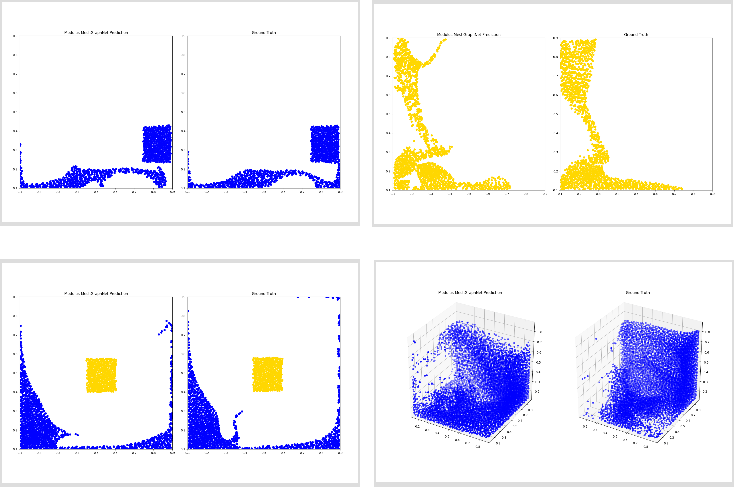

# MeshGraphNet with Lagrangian mesh
这是一个基于粒子模拟的MeshGraphNet示例，基于
[Learning to Simulate](https://sites.google.com/view/learning-to-simulate/)
工作。它演示了如何使用图神经网络（GNN）模拟拉格朗日流体、固体和可变形材料。
## 问题描述


在本项目中，我们提供了一个基于拉格朗日网格的流体仿真示例。拉格朗日网格采用基于粒子的方法，其中顶点代表流体粒子，边则表示它们之间的相互作用。与欧拉网格（网格固定不变）相比，拉格朗日网格更加灵活，因为它不需要对领域进行网格划分或与边界对齐。

因此，拉格朗日网格非常适合表示复杂的几何形状和自由边界问题，例如水花飞溅和物体碰撞。然而，拉格朗日仿真的一个缺点是通常需要设置更小的时间步长，以保持物理预测的有效性。

## 数据集


对于这个例子，我们使用[DeepMind的粒子物理数据集](https://sites.google.com/view/learning-to-simulate).
其中一些数据集包含基于粒子的流体飞溅和反弹模拟在盒子或立方体内，而其他人则使用沙子或粘稠物等材料。
总共有17个数据集，其中一些如下：

| Datasets     | Num Particles | Num Time Steps |    dt    | Ground Truth Simulator |
|--------------|---------------|----------------|----------|------------------------|
| Water-3D     | 14k           | 800            | 5ms      | SPH                    |
| Water        | 2k            | 1000           | 2.5ms    | MPM                    |
| WaterRamp    | 2.5k          | 600            | 2.5ms    | MPM                    |
| Sand         | 2k            | 320            | 2.5ms    | MPM                    |
| Goop         | 1.9k          | 400            | 2.5ms    | MPM                    |

请参阅[原始论文]中的**B.1**节(https://arxiv.org/abs/2002.09405).

## 模型概述和架构

该模型使用MeshGraphNet来捕捉流体系统的动力学。该系统被表示为图，边缘表示它们的相互作用。该模型是自回归的，利用历史数据预测未来状态。顶点的输入特征包括当前位置、速度、节点类型（例如，流体、沙子、边界），以及历史速度。模型的输出是加速度，定义为差值在当前速度和下一速度之间。速度和加速度均由下式推导得出位置序列并归一化为标准高斯分布为了保持一致性。

为了提高计算效率，我们没有明确地为以下对象构造墙节点正方形或立方体域。相反，我们为每个内部指定一个墙特征
粒子节点，表示其与域边界的距离。对于a系统维度为$d=2$或$d=3$，特征是结构化的如下：

- **节点特征**:
  - 位置（维度为d）
  - 历史速度（维度为 t×d），其中时间步数 t 可通过配置参数 data.num_history 设置
  - 节点类型的独热编码（例如6种类型）
  - 壁面特征（维度为 2×d）
- **边特征**：位移（维度为d）、距离（维度为1）
- **节点目标**：加速度（维度为d）

我们根据预设的半径构建边，当两个粒子节点之间的距离小于该半径时建立连接。训练过程中，我们对时间序列进行打乱，并以批次形式训练，图结构在数据加载器中动态构建。推理时，预测结果通过迭代方式展开，并基于先前的预测动态构建新的图结构。壁面特征在此过程中在线计算。为了增强模型的鲁棒性，训练时会添加少量噪声。

模型的编码器、处理器和解码器的隐藏维度均为128。编码器和解码器各包含两层隐藏层，处理器由十层消息传递层组成。以Water数据集为例，每个GPU使用的批量大小为20，处理器中的消息传递采用求和聚合方式。学习率设置为0.0001，并采用余弦退火调度进行衰减。这些超参数可通过命令行或配置文件进行调整。


## 训练

此示例需要使用`tensorflow`库加载`.tfrecord`格式的数据集

```bash
pip install "tensorflow<=2.17.1"
```

要从DeepMind的仓库下载数据，请运行：

```bash
cd raw_dataset
bash download_dataset.sh Water ./data/
```

此示例使用[Hydra](https://hydra.cc/docs/intro/)用于[实验](https://hydra.cc/docs/patterns/configuring_experiments/)
配置。Hydra提供了一种方便的方法来修改几乎任何实验参数，
例如数据集设置、模型配置和优化器选项，
通过命令行或配置文件。

要查看完整脚本选项，请运行以下命令：

```bash
python train.py --help
```

如果遇到 Hydra 配置问题，可能会收到不太有帮助的错误信息。此时，可以设置环境变量 `HYDRA_FULL_ERROR=1`，以获取更详细的错误信息：
```bash
HYDRA_FULL_ERROR=1 python train.py ...
```

以使用Water数据集训练模型为例，请运行：

```bash
python train.py +experiment=water data.data_dir=./data/Water resume_dir=./model/Water
```

可以使用 Weights & Biases 监控训练进度和损失日志。要启用该功能，请在命令行中将 `loggers.wandb.mode` 设置为 `online`：

```bash
python train.py +experiment=water data.data_dir=./data/Water resume_dir=./model/Water loggers.wandb.mode=online

```
需要一个有效的 Weights & Biases 账户。您还需要通过命令行选项 `loggers.wandb.wandb_key` 设置您的 API 密钥，或者使用环境变量 `WANDB_API_KEY`：

```bash
export WANDB_API_KEY=key
python train.py ...
```
多卡训练：

```bash
mpirun -np <num_GPUs> --allow-run-as-root python train.py ...
```

torchrun启动多节点多卡训练：

```bash
torchrun --standalone --nnodes=<num_nodes> --nproc_per_node=<num_GPUs> train.py  ...

## 推理

推理脚本 `inference.py` 也支持 Hydra 配置，确保训练和推理过程的一致性。

模型训练完成后，运行以下命令：
```bash
python inference.py +experiment=water \
    data.data_dir=./data/Water \
    data.test.num_sequences=4 \
    resume_dir=./model /water \
    output=./result/water/inference
```

使用 `resume_dir` 参数指定模型检查点的位置。

这会将测试数据集的预测结果保存为动画 `.gif` 文件，存放在 `./result/water/inference/animations` 目录下。

脚本还会生成一个 `error.png` 文件，用于展示展开误差的可视化。

结果可能类似于以下之一


<figure style="text-align: center;">
  
  <figcaption><b>图 1.</b> 预测结果可视化</figcaption>
</figure>

## 参考

- [Learning to simulate complex physicswith graph networks](arxiv.org/abs/2002.09405)
- [Dataset](https://sites.google.com/view/learning-to-simulate)
- [Learning Mesh-Based Simulation with Graph Networks](https://arxiv.org/abs/2010.03409)
