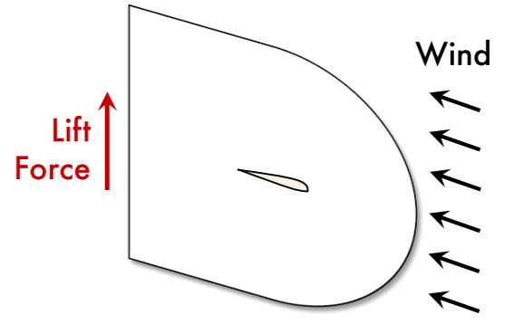
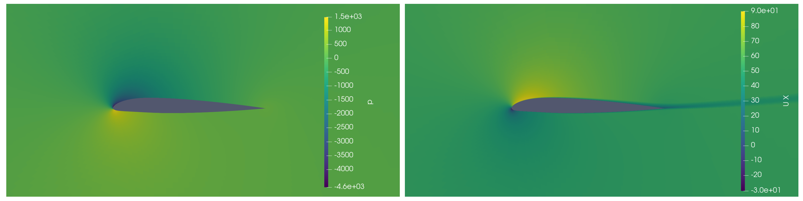
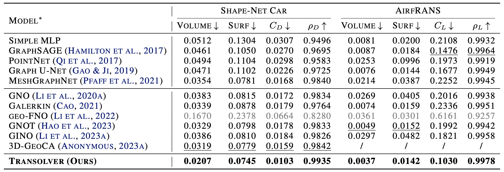

# Transolver for Airfoil Design


这是一个用于翼型设计的模型，它用于在不同雷诺数和攻角条件下，估计二维翼型周围及表面的物理量。模型参照[Transolver](https://arxiv.org/abs/2402.02366) 中的开源模型代码进行构建。

<p align="center">

<br><br>
<b>Figure 1.</b> 翼型设计任务。
</p>

## 模型结构

Transolver是一种基于物理感知令牌的Transformer PDE求解器，通过将网格点自适应划分为物理相关的切片，实现令牌级别的物理注意力计算，显著降低计算复杂度并提升几何泛化能力。其核心特点包括线性复杂度的高效注意力机制、对非结构化网格的天然适应性，以及在复杂物理场景和分布外条件下的强泛化性能。

## 模型训练

1. 安装依赖包。为方便起见，请执行以下命令：

```bash
pip install -r requirements.txt
```


2. 数据准备

实验数据由[AlfRANS](https://github.com/Extrality/AirfRANS)提供。您可以通过此[链接](https://data.isir.upmc.fr/extrality/NeurIPS_2022/Dataset.zip)直接下载（9.3GB）。

3. 训练

参数说明

| 参数名              | 类型    | 默认值              | 作用说明                                                                                      |
|---------------------|---------|--------------------|---------------------------------------------------------------------------------------------|
| `--data_path`        | str     | `./dataset/Dataset`| 数据集路径。注意不要在路径末尾添加多余空格。                                                   |
| `--save_path`        | str     | `./metrics`        | 模型及相关指标的保存路径。                                                                     |
| `--result_path`      | str     | `./results`        | 预测结果保存路径。                                                                             |
| `--model`            | str     | `Transolver`       | 选择训练的模型，可选项包括 Transolver, MLP, GraphSAGE, PointNet, GUNet。默认 Transolver。       |
| `-n, --nmodel`       | int     | 1                  | 训练模型的数量，用于标准差估计。默认值为1。                                                    |
| `-w, --weight`       | float   | 1                  | 表面损失项前的权重。默认值为1。                                                                |
| `-t, --task`         | str     | `full`             | 训练任务类型，可选 "full"、"scarce"、"reynolds"、"aoa"。默认 "full"。                         |
| `-s, --score`        | int     | 0                  | 是否在训练模型后直接进行推理评估，0表示不计算，非0表示计算。默认0。                             |
| `--gpu`              | int     | 0                  | 指定使用的GPU编号，默认为0，如无GPU则使用CPU。                                                |
| `-n_test`            | int     | 3                  | 进行推理的翼型数量，将从给定数据集中随机抽取。默认3个。                                         |

我们在文件夹`./scripts/`提供了运行的脚本，脚本中默认为单卡执行。您可以使用以下命令执行:

```bash
bash scripts/Transolver.sh # for Training Transolver
bash scripts/Evaluation.sh # for Evaluation
```

多卡训练：

```bash
mpirun -np <num_GPUs> --allow-run-as-root python main.py
```

torchrun启动多节点多卡训练：

```bash
torchrun --standalone --nnodes=<num_nodes> --nproc_per_node=<num_GPUs> main.py
```

注意：您需要将参数`--my_path`更改为数据集路径。`-model`参数可以选择模型，本项目中共支持5个模型Transolver, MLP, GraphSAGE, PointNet, GUNet。可以同时训练多个模型，但是建议一次只训练一个模型。

4. 使用不同设置测试模型。此基准支持四种类型的设置。

| Settings                                     | Argument      |
| -------------------------------------------- | ------------- |
| Use full data                                | `-t full`     |
| Use scarce data                              | `-t scarce`   |
| Test on out-of-distribution Reynolds         | `-t reynolds` |
| Test on out-of-distribution Angle of Attacks | `-t aoa`      |

5.您也可以选择添加自己的模型。以下是说明：

-在文件夹`./models/`下添加模型文件。

-在`./params.yaml`中添加模型参数详细信息。

-将模型配置添加到`./main.py`中。

-在文件夹 `./scripts/`下添加脚本文件，并更改参数--model。

## 结果展示

<p align="center">

<br><br>
<b>Figure 2.</b> 预测结果。左：周围压力；右：x方向风速。
</p>


在现有的几个模型中，Transolver在实际设计任务中获得了最佳性能。

<p align="center">

<br><br>
<b>Table 1.</b> 不同模型的对比
</p>


## 参考

[Transolver: A Fast Transformer Solver for PDEs on General Geometries](https://arxiv.org/abs/2402.02366)

https://github.com/thuml/Transolver/tree/main
