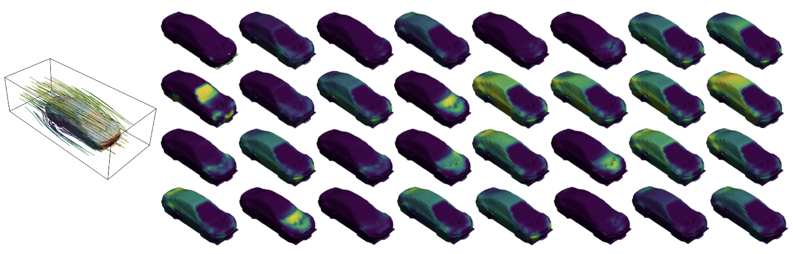

# Transolver for Car Design

这是一个用于预测汽车设计任务的模型，它用于预测驾驶汽车周围的风速和表面压力，以此来计算风阻系数。模型参照[Transolver](https://arxiv.org/abs/2402.02366) 中的开源模型代码进行构建。

<p align="center">

<br><br>
<b>Figure 1.</b> 汽车设计任务. 
</p>

记录了周围风、表面压力和[阻力系数](https://en.wikipedia.org/wiki/Drag_coefficient)的相对误差，以及[斯皮尔曼等级相关性](https://en.wikipedia.org/wiki/Spearman%27s_rank_correlation_coefficient)，可用于量化模型对不同设计进行排名的能力。

<p align="center">

<br><br>
<b>Table 1.</b> 汽车设计任务的模型比较. 
</p>

## 模型结构

Transolver是一种基于物理感知令牌的Transformer PDE求解器，通过将网格点自适应划分为物理相关的切片，实现令牌级别的物理注意力计算，显著降低计算复杂度并提升几何泛化能力。其核心特点包括线性复杂度的高效注意力机制、对非结构化网格的天然适应性，以及在复杂物理场景和分布外条件下的强泛化性能。


## 模型训练


1. 数据准备

原始数据可以此处[[下载]](http://www.nobuyuki-umetani.com/publication/mlcfd_data.zip)，由[Nobuyuki Umetani](https://dl.acm.org/doi/abs/10.1145/3197517.3201325)提供。

2. 训练和评估模型

参数说明

| 参数名             | 类型    | 默认值                         | 作用说明                                            |
|--------------------|---------|-------------------------------|---------------------------------------------------|
| `--data_dir`       | str     | `./dataset/mlcfd_data/training_data` | 训练数据所在目录路径，包含所有原始CFD数据文件。           |
| `--preprocessed_save_dir`       | str     | `./dataset/mlcfd_data/preprocessed_data` | 预处理数据保存目录，用于存储处理后的训练/验证数据。        |
| `--model_save_dir`       | str     | `./metrics` | 训练后的模型保存目录。        |
| `--fold_id`        | int     | 0                             | 选择哪个param子文件夹作为测试/验证集。|
| `--gpu`            | int     | 0                             | 指定使用的GPU编号，默认为0，若无GPU则使用CPU。           |
| `--val_iter`       | int     | 10                            | 验证时每隔多少个训练迭代执行一次模型验证。                |
| `--cfd_config_dir` | str     | `cfd/cfd_params.yaml`         | CFD仿真参数配置文件路径。                               |
| `--cfd_model`      | str     | `Transolver`                  | 选择的CFD模型名称。                                    |
| `--cfd_mesh`       | bool    | False                         | 是否使用CFD网格信息，启用后会使用网格相关特征。             |
| `--r`              | float   | 0.2                           | 影响图神经网络邻域范围的半径参数。                       |
| `--weight`         | float   | 0.5                           | 压力项损失的权重比例，默认0.5。                         |
| `--lr`             | float   | 0.001                         | 模型训练时初始的学习率。                                   |
| `--batch_size`     | int     | 1                             | 训练或验证时的批大小。                                 |
| `--nb_epochs`      | int     | 200                           | 总训练轮数。                                          |
| `--preprocessed`   | int     | 1                             | 是否使用预处理数据，1为使用，0为不使用。                 |
| `--result_dir`  | str     | `./results`             | 推理结果保存的根目录，包括npy、vtk、vis等子目录。     |
| `--save_vtk`     | bool    | False                   | 是否保存推理预测结果为VTK文件，便于后续可视化。         |
| `--visualize`    | bool    | False                   | 是否基于VTK文件生成可视化图片，需配合`--save_vtk`使用。   |


我们在文件夹`./scripts/`提供了运行的脚本，脚本中默认为单卡执行。您可以使用以下命令执行:

```bash
bash scripts/Transolver.sh # for Training 
bash scripts/Evaluation.sh # for Evaluation
```

多卡训练：

```bash
mpirun -np <num_GPUs> --allow-run-as-root python main.py
```

torchrun启动多节点多卡训练：

```bash
torchrun --standalone --nnodes=<num_nodes> --nproc_per_node=<num_GPUs> main.py
```
若在 Docker 容器内运行，多GPU命令可能需加 `--allow-run-as-root`。

注意: 您需要将参数 `--data_dir `和 `--preprocessed_save_dir `更改为数据集路径。这里的`data_dir`用于原始数据，`preprocessed_save_dir`则用于保存预处理后的数据。

如果您已经下载或生成了预处理的数据，可以将`--preprocessed`更改为True以加快速度，不使用`--preprocessed`时默认为true。

在推理时，加入`--save_vtk`选项可以将模型预测的结果保存为vtk文件（保存在results文件夹内），即可paraview中进行可视化。

加入`--visualize`选项可以直接将模型预测的结果直接进行可视化展示，不过生成的图片为静态的，不能转换视角，这里更建议使用paraview。`--visualize`选项需与`--save_vtk`选项搭配使用。

3.您也可以选择添加自己的模型。以下是说明：

-在文件夹`./models/`下添加模型文件。

-将模型配置添加到`./main.py`中。

-在文件夹 `./scripts/`下添加脚本文件，并更改参数--model。

## 可视化

以下可视化结果表明，Transolver可以成功地将相似物理状态下的点归因于同一切片，如挡风玻璃、车牌和前照灯。

<p align="center">

<br><br>
<b>Figure 2.</b> Transolver学习物理状态的可视化. 
</p>


## 示例展示

Transolver在复杂几何形状和混合物理中实现了最佳性能。

<p align="center">

<br><br>
<b>Figure 3.</b>Transolver和其他模型的对比. 
</p>

## 参考

[Transolver: A Fast Transformer Solver for PDEs on General Geometries](https://arxiv.org/abs/2402.02366)

https://github.com/thuml/Transolver/tree/main