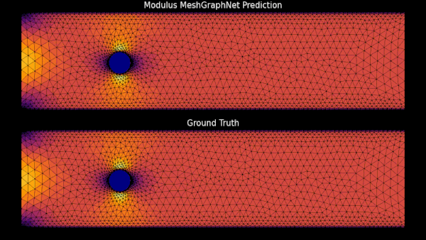

# vortex_shedding_mgn

本示例是 DeepMind 涡激示例的 PyTorch 版本重实现，原项目链接 <https://github.com/deepmind/deepmind-research/tree/master/meshgraphnets> 。演示如何训练图神经网络（Graph Neural Network，GNN）评估参数化几何体上的瞬态涡激。

## 问题描述

基于网格的模拟在科学和工程各领域复杂物理系统建模中起核心作用。它们提供了稳健的数值积分方法，并允许自适应分辨率以权衡精度和效率。机器学习代理模型作为强大工具，能降低设计优化、设计空间探索和假设分析等任务的计算成本，这些任务通常需要重复高维科学模拟。

然而，部分现有机器学习代理模型（如 CNN 类型）受限于结构化网格，在复杂几何体或壳体问题中表现欠佳。CNN 同质化的保真度限制了对多尺度物理场需自适应网格表示的复杂物理系统的适用性。

图神经网络（GNN）为科学工程代理建模提供了可行方案。GNN 是数据驱动的，能够处理复杂物理问题。作为基于网格的方法，GNN 可以处理几何不规则性和多尺度物理，适合广泛应用。

## 数据集

本示例使用 DeepMind 的涡激数据集。数据集包括 1000 个训练样本，100 个验证样本和 100 个测试样本，使用 COMSOL 在不规则二维三角网格上模拟得到，每个样本包含 600 个时间步长，步长大小为 0.01 秒。样本中气缸的尺寸和位置各异。因样本几何体不同，每个样本拥有独特网格，网格平均含 1885 个节点。模型支持输入不同节点数和边数的异构网格。

## 模型架构

模型为自由运行自回归模型。输入为初始条件，预测第一个时间步的解；随后以时间步  的预测作为输入，预测时间步  的解，循环迭代直至完成整个时间序列预测。模型还能预测超出仿真时间范围的结果并实现时间外推，但预测精度可能随时间下降，除非数据模式稳定一致，否则不建议长时间外推。

模型利用输入网格为每个样本构建双向的 DGL 图。节点特征共 6 维：

- 时间步  的速度分量，即 ,  
- 节点类型独热编码（内点、无滑移边界点、入口点、出口点）

边特征为时间不变，共 3 维：

- 边两端节点间的相对 、 距离  
- 相对距离向量的 L2 范数

模型输出为时间步  的速度分量，即 , ，以及压力。

<p align="center">

<br><br>
图 1. MeshGraphNet 预测与真实水平速度对比，针对不同测试样本。
</p>

编码器、处理器和解码器中隐藏维度均为128。编码器和解码器各含两层隐藏层，处理器包含15层消息传递。每GPU批大小设为1。处理器中消息聚合采用求和聚合。学习率为0.0001，指数衰减率为0.9999991。  

## 训练

本示例依赖 `tensorflow` 库以加载 `.tfrecord` 格式数据。安装命令：

```bash
pip install tensorflow
```

从 DeepMind 仓库下载数据：

```bash
cd raw_dataset
sh download_dataset.sh cylinder_flow
```

训练模型：

```bash
python train.py
```

支持多GPU数据并行训练，启动命令示例：

```bash
mpirun -np <num_GPUs> python train.py
```

若在 Docker 容器内运行，多GPU命令可能需加 `--allow-run-as-root`。

训练进度和损失日志可用 Weights & Biases 监控。开启方法：在 `constants.py` 中将 `wandb_mode` 设为 `online`，并需有有效的 Weights & Biases 账号及 API key。可通过环境变量导出API key：

```bash
export WANDB_API_KEY=<your_api_key>
```

运行时终端会显示仪表盘地址。也可在 `train.py` 中切换日志工具至 MLFlow。

训练结束后运行：

```bash
python inference.py
```
预测结果将保存为 `.gif` 格式，位于 `animations` 文件夹中。

## References

- [Learning Mesh-Based Simulation with Graph Networks](https://arxiv.org/abs/2010.03409)