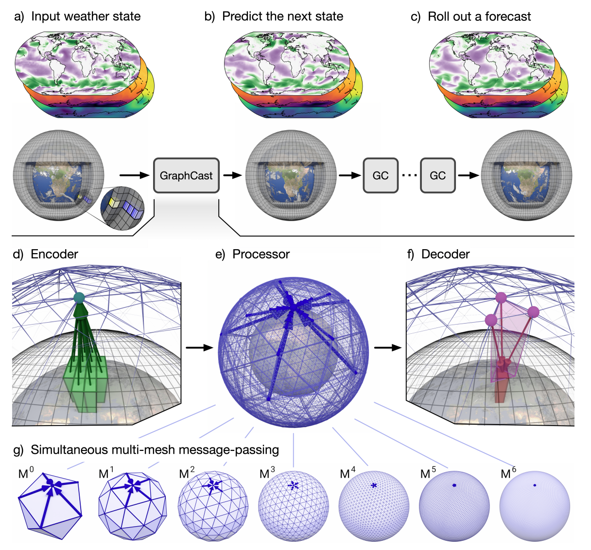

# GraphCast

该项目为在 onescience中重新实现 DeepMind 的[GraphCast](https://arxiv.org/abs/2212.12794) 模型。

## 模型简介

GraphCast 是一种基于多尺度图神经网络的自回归模型。它基于 ECMWF ERA5 再分析档案中的历史天气数据进行训练。GraphCast 以 6 小时为时间步长，针对一组地表和大气变量生成预测。此预测涵盖 0.25 度经纬度网格，在赤道处提供约 25 x 25 公里的分辨率。



## 数据集

该模型在 ERA5 再分析数据上进行训练，这些大气变量在单层和压力层上经过预处理并存储到 HDF5 文件中。还使用了其他静态通道，例如陆地-海洋掩模和位势，以及余弦天顶角(通过修改配置文件中use_cos_zenith参数决定是否使用)。ERA5 数据集可从onescience中的dataset_download工具下载，该工具可自动转化为graphcast模型训练所需格式。

数据集格式如下：

```
dataset\
|----train\
|    |----1980.h5
|    |----1981.h5
|    |----1982.h5
|    |----...
|----val\
|    |----2016.h5
|    |----2017.h5
|----test\
|    |----2018.h5
|    |----2019.h5
|----stats\
|    |----global_means.npy
|    |----global_stds.npy
|----static\
|    |----orography.h5
|----time_diff_std\
|    |----time_diff_std_new.npy
|    |----time_diff_mean_new.npy
|----data.json\
```

静态数据static、data.json和time_diff_std需要使用者自行准备，其中data.json中存储每个channel的名称，格式如下：

```
{
    "coords": {
        "channel": {
            "0": "t2m",
            "1": "msl",
            "2": "10u",
            "3": "10v",
            "4": "tp",
            "5": "z50",
            "6": "z100"
            ...
        }
    }
}
```

标准化每个变量的每个压力水平时间差异的标准偏差 .npy 文件可通过compute_time_diff_std.py脚本计算得到。

## 模型训练

单卡训练：

```bash
python train_graphcast.py
```

多卡训练：

```bash
mpirun -np <num_GPUs> --allow-run-as-root python train_graphcast.py
```

torchrun启动多节点多卡训练：

```
torchrun --standalone --nnodes=<num_nodes> --nproc_per_node=<num_GPUs> train_graphcast.py
```

使用合成数据进行训练：

```
python train_graphcast.py synthetic_dataset=true
```

可以使用 Weights & Biases 监控进度和损失日志。这需要有一个 Weights & Biases 帐户。需要提供 API 密钥。有多种方式可以提供 API 密钥，但可以简单地将其导出为环境变量

```bash
export WANDB_API_KEY=<your_api_key>
```

运行启动后，仪表板的 URL 将显示在终端中。可以通过以下方式禁用Weights & Biases

```bash
export WANDB_MODE='disabled'
```

或者修改配置禁用：

```
python train_graphcast.py wb_mode=disabled
```

## 参考

- [GraphCast: Learning skillful medium-range global weather forecasting](https://arxiv.org/abs/2212.12794)
