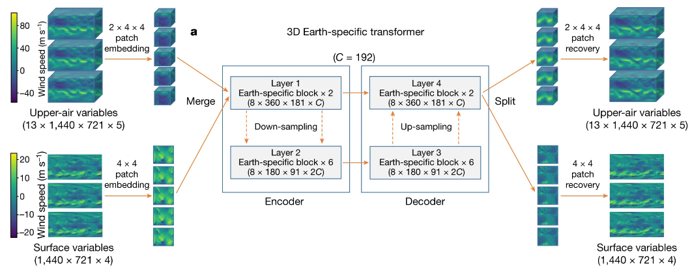

# Pangu-weather

该项目为在onescience中重新实现华为的[pangu](https://www.nature.com/articles/s41586-023-06185-3) 模型。
s
## 模型简介

华为云盘古气象大模型是首个精度超过传统数值预报方法的AI模型，速度相比传统数值预报提速10000倍以上。目前，盘古气象大模型能够提供全球气象秒级预报，其气象预测结果包括位势、湿度、风速、温度、海平面气压等，可以直接应用于多个气象研究细分场景，欧洲中期预报中心和中央气象台等都在实测中发现盘古预测的优越性。



## 数据集

该模型在ERA5再分析数据上进行训练，这些大气变量在单层和压力层上经过预处理并存储到HDF5文件中，数据集中包含了4个地表变量、5个13压力层级的大气变量，除此之外还包含3个静态变量，例如陆地掩模和位势。

数据集格式如下：

```
dataset\
|----train\
|    |----1980.h5
|    |----1981.h5
|    |----1982.h5
|    |----...
|----val\
|    |----2016.h5
|    |----2017.h5
|----test\
|    |----2018.h5
|    |----2019.h5
|----stats\
|    |----global_means.npy
|    |----global_stds.npy
|----static\
|    |----soil_type.npy
|    |----land_mask.npy
|    |----topography.npy
```

## 模型训练

单机单卡训练：

```bash
bash train_single_node_single_device.sh
```

单机多卡训练：

```bash
bash train_single_node_multi_device.sh
```

多机多卡训练：

```bash
sbatch slurm.sh
```

单机单卡推理：

```bash
python inference.py
```

误差计算：

```bash
python result.py
```

## 参考

- [Accurate medium-range global weather forecasting with 3D neural networks](https://www.nature.com/articles/s41586-023-06185-3)
