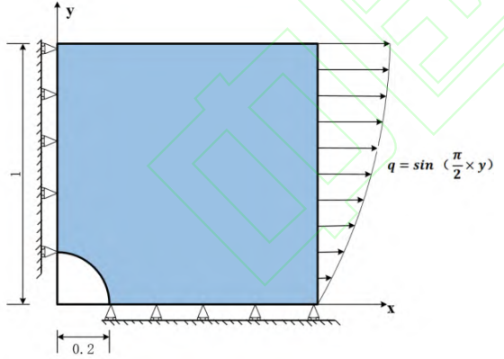
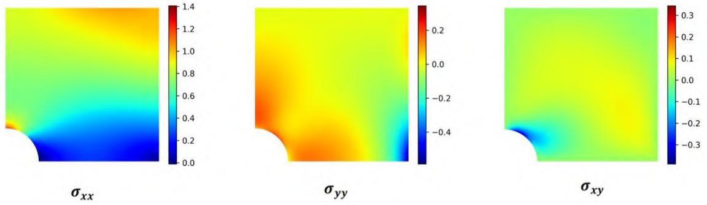
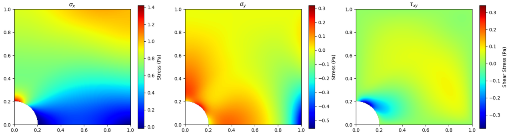

# PINN_Plane_Stress

基于物理信息神经网络（PINN）的平面应力问题求解器 

---

## 案例介绍
### 带缺陷板的平面应力问题

本代码实现了论文中《物理信息神经网络方法求解平面应力问题》算例二（带缺陷板的平面应力分析）PINN的求解过程。针对左下角含1/4圆孔的正方形板，在复杂边界条件和正弦分布荷载作用下，通过PINN方法无网格求解位移场和应力场，有效避免了传统有限元的剪切锁死问题。


弹性模量 E 为5Pa，泊松比 μ 为 0.3。正方形边长为 1m，圆的圆心在（0，0）处，半径为 0.2m，在正方形板的右侧施加大小为 q=sin（y*π/2）的分布力。

<figure style="text-align: center;">
  
  <figcaption><b>图 1.</b> 缺陷板结构图。</figcaption>
</figure>

### 边界条件

1. **应力边界条件：**

- 在右侧边界（x=1），沿 x 方向的正应力分量根据坐标 y 变化，数值为 q=sin（y*π/2）。
- 在下边界（y=0）、左边界（x=0）以及顶部边界（y=1），切向应力均等于零。
- 顶边界（y=1）处的法向应力也为零

2. **弧线应力边界条件：**

- 在边界上，轨线方向的应力分量满足平衡方程，即某一边界点上的两个正应力分量与切应力分量的乘积，与法向量分量相乘并相加后等于零。
- 这里的法向向量分量分别是关于 x 轴和 y 轴的余弦值，保证沿边界方向的应力达到平衡。

3. **位移边界条件：**

- 在左侧边界（x=0），沿 x 方向的位移为零。
- 在底部边界（y=0），沿 y 方向的位移为零。

---

## 模型训练和预测


1.模型训练

```bash
python Train.py 

```
2.模型预测，支持保存可视化图片到本地

```bash
python Inference.py 

```
<figure style="text-align: center;">
  
  <figcaption><b>图 2.</b> 有限元法模拟结果。</figcaption>
</figure>
<figure style="text-align: center;">
  
  <figcaption><b>图 3.</b> PINN模拟结果。</figcaption>
</figure>
